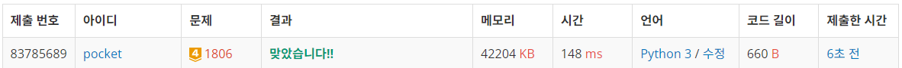
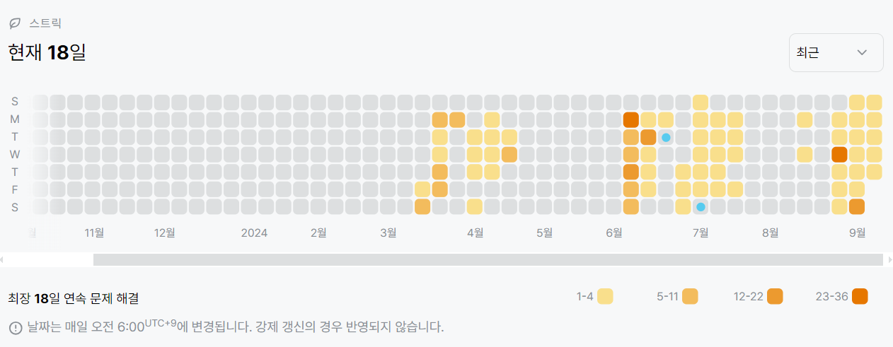

1806번: 부분합 (골드 4)
| 시간 제한 | 메모리 제한 |
|:-----:|:------:|
|  0.5초   | 128MB  |

## 문제
10,000 이하의 자연수로 이루어진 길이 N짜리 수열이 주어진다. 이 수열에서 연속된 수들의 부분합 중에 그 합이 S 이상이 되는 것 중, 가장 짧은 것의 길이를 구하는 프로그램을 작성하시오.


## 문제 설명
```text
1. 투 포인터를 활용한다.
2. 총합이 S를 넘지 않으면 뒤의 인덱스를 1 증가시키고, 증가시킨 값이 범위를 벗어나면 break한다.
3. 총합이 S이상이라면 인덱스의 차이를 계산하여 길이를 구하고, 길이와 결과값 중 작은것을 결과값에 대입한다.
4. 결과값 업데이트를 했다면, 앞의 인덱스를 1 증가시키고, 증가시킨 값이 뒤의 인덱스보다 크다면, 뒤의 인덱스도 1 증가시킨다. (무조건 뒤에 있게 만들기 위해서)
5. 2번과 마찬가지로 뒤의 인덱스 값이 범위를 벗어나면 break한다.
```

## 입력
첫째 줄에 N (10 ≤ N < 100,000)과 S (0 < S ≤ 100,000,000)가 주어진다. 둘째 줄에는 수열이 주어진다. 수열의 각 원소는 공백으로 구분되어져 있으며, 10,000이하의 자연수이다.

## 출력
첫째 줄에 구하고자 하는 최소의 길이를 출력한다. 만일 그러한 합을 만드는 것이 불가능하다면 0을 출력하면 된다.


## 예제 입력 1 
```text
10 15
5 1 3 5 10 7 4 9 2 8
```
## 예제 출력 1 
```text
2
```


## 코드
```python
import sys
input = sys.stdin.readline

N, S = map(int, input().rstrip().split())
buf = list(map(int, input().rstrip().split()))
nums = [0 for _ in range(N + 1)]
nums[1] = buf[0]
for i in range(2, N + 1):
    nums[i] += nums[i - 1] + buf[i - 1]

front, rear = 0, 1
res = float('inf')

while True:
    s = nums[rear] - nums[front] if rear != front else nums[rear]
    if s < S:
        rear += 1
        if rear == N + 1:
            break
    else:
        res = min(res, rear - front if rear - front else 1)
        front += 1
        if rear < front:
            rear += 1
        if rear == N + 1:
            break

print(res if res != float('inf') else 0)


```

## 채점 결과


## 스트릭
