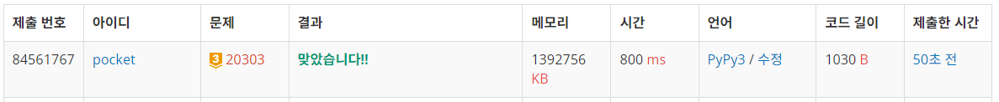
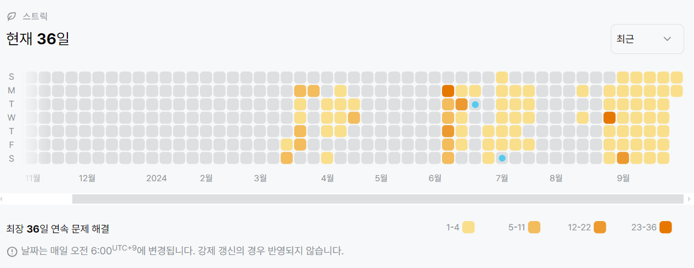

20303번: 할로윈의 양아치 (골드 3)
| 시간 제한 | 메모리 제한 |
|:-----:|:------:|
|  1초   | 1024MB  |

## 문제
Trick or Treat!!

10월 31일 할로윈의 밤에는 거리의 여기저기서 아이들이 친구들과 모여 사탕을 받기 위해 돌아다닌다. 올해 할로윈에도 어김없이 많은 아이가 할로윈을 즐겼지만 단 한 사람, 일찍부터 잠에 빠진 스브러스는 할로윈 밤을 즐길 수가 없었다. 뒤늦게 일어나 사탕을 얻기 위해 혼자 돌아다녀 보지만 이미 사탕은 바닥나 하나도 얻을 수 없었다.

단단히 화가 난 스브러스는 거리를 돌아다니며 다른 아이들의 사탕을 빼앗기로 마음을 먹는다. 다른 아이들보다 몸집이 큰 스브러스에게 사탕을 빼앗는 건 어렵지 않다. 또한, 스브러스는 매우 공평한 사람이기 때문에 한 아이의 사탕을 뺏으면 그 아이 친구들의 사탕도 모조리 뺏어버린다. (친구의 친구는 친구다?!)

사탕을 빼앗긴 아이들은 거리에 주저앉아 울고 
$K$명 이상의 아이들이 울기 시작하면 울음소리가 공명하여 온 집의 어른들이 거리로 나온다. 스브러스가 어른들에게 들키지 않고 최대로 뺏을 수 있는 사탕의 양을 구하여라.

스브러스는 혼자 모든 집을 돌아다녔기 때문에 다른 아이들이 받은 사탕의 양을 모두 알고 있다. 또한, 모든 아이는 스브러스를 피해 갈 수 없다. 


## 문제 설명
```text
1. 분리집합을 통해 집합의 크기와 값어치를 구한 뒤, 이 값 쌍을 통해 0-1 배낭 알고리즘을 사용한다. 
```

## 입력
첫째 줄에 정수 
$N$, 
$M$, 
$K$가 주어진다. 
$N$은 거리에 있는 아이들의 수, 
$M$은 아이들의 친구 관계 수, 
$K$는 울음소리가 공명하기 위한 최소 아이의 수이다. (
$1 \leq N \leq 30\ 000$, 
$0 \leq M \leq 100\ 000$, 
$1 \leq K \leq \min\left\{N, 3\ 000\right\}$)

둘째 줄에는 아이들이 받은 사탕의 수를 나타내는 정수 
$c_1, c_2, \cdots, c_N$이 주어진다. (
$1 \leq c_i \leq 10\ 000$)

셋째 줄부터 
$M$개 줄에 갈쳐 각각의 줄에 정수 
$a$, 
$b$가 주어진다. 이는 
$a$와 
$b$가 친구임을 의미한다. 같은 친구 관계가 두 번 주어지는 경우는 없다. (
$1 \leq a, b \leq N$, 
$a \neq b$)


## 출력
스브러스가 어른들에게 들키지 않고 아이들로부터 뺏을 수 있는 최대 사탕의 수를 출력한다.


## 예제 입력 1 
```text
10 6 6
9 15 4 4 1 5 19 14 20 5
1 3
2 5
4 9
6 2
7 8
6 10
```
## 예제 출력 1 
```text
57
```

## 예제 입력 2
```text
5 4 4
9 9 9 9 9
1 2
2 3
3 4
4 5
```

## 예제 출력 2
```text
57
```

## 코드
```python
import sys
input = sys.stdin.readline
sys.setrecursionlimit(10**7)

N, M, K = map(int, input().rstrip().split())
candy = [0] + list(map(int, input().rstrip().split()))

friend = [i for i in range(N + 1)]
group = [0 for _ in range(N + 1)]

K -= 1

def find(x):
    if friend[x] != x:
        friend[x] = find(friend[x])
    return friend[x]

def union(x, y):
    x, y = find(x), find(y)
    if x < y:
        friend[y] = x
    else:
        friend[x] = y

for _ in range(M):
    a, b = map(int, input().rstrip().split())
    union(a, b)

for i in range(1, N + 1):
    if i != friend[i]:
        _i = find(i)
        candy[_i] += candy[i]
        group[_i] += 1
    else:
        group[i] += 1

dp = [0 for _ in range(K + 1)]

for i in range(1, N + 1):
    if group[i] != 0:
        w = group[i]
        v = candy[i]
        if w > K:
            continue
        for j in range(K, 0, -1):
            if j + w <= K and dp[j] != 0:
                dp[j + w] = max(dp[j + w], dp[j] + v)
        dp[w] = max(dp[w], v)

print(max(dp))
```

## 채점 결과


## 스트릭
