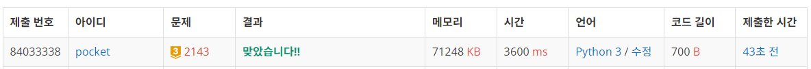
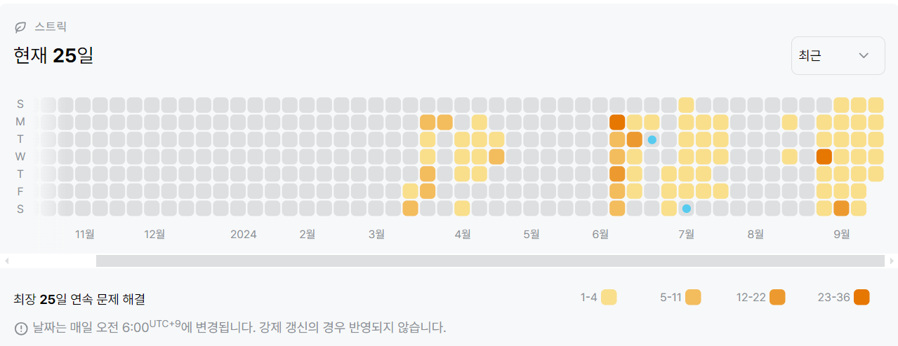

2143번: 두 배열의 합 (골드 3)
| 시간 제한 | 메모리 제한 |
|:-----:|:------:|
|  2초   | 64MB  |

## 문제
한 배열 A[1], A[2], …, A[n]에 대해서, 부 배열은 A[i], A[i+1], …, A[j-1], A[j] (단, 1 ≤ i ≤ j ≤ n)을 말한다. 이러한 부 배열의 합은 A[i]+…+A[j]를 의미한다. 각 원소가 정수인 두 배열 A[1], …, A[n]과 B[1], …, B[m]이 주어졌을 때, A의 부 배열의 합에 B의 부 배열의 합을 더해서 T가 되는 모든 부 배열 쌍의 개수를 구하는 프로그램을 작성하시오.

예를 들어 A = {1, 3, 1, 2}, B = {1, 3, 2}, T=5인 경우, 부 배열 쌍의 개수는 다음의 7가지 경우가 있다.

```text
T(=5) = A[1] + B[1] + B[2]
      = A[1] + A[2] + B[1]
      = A[2] + B[3]
      = A[2] + A[3] + B[1]
      = A[3] + B[1] + B[2]
      = A[3] + A[4] + B[3]
      = A[4] + B[2] 
```


## 문제 설명
```text
1. 각 배열의 부분 연속 배열(최소 길이 1)의 모든 합을 미리 구한다.
2. bisect라이브러리를 사용하여 두 배열의 합이 T가 되는 값이 있는지 확인하고, 있다면 값을 증가시킨다.
```

## 입력
첫째 줄에 T(-1,000,000,000 ≤ T ≤ 1,000,000,000)가 주어진다. 다음 줄에는 n(1 ≤ n ≤ 1,000)이 주어지고, 그 다음 줄에 n개의 정수로 A[1], …, A[n]이 주어진다. 다음 줄에는 m(1 ≤ m ≤ 1,000)이 주어지고, 그 다음 줄에 m개의 정수로 B[1], …, B[m]이 주어진다. 각각의 배열 원소는 절댓값이 1,000,000을 넘지 않는 정수이다.

## 출력
첫째 줄에 답을 출력한다. 가능한 경우가 한 가지도 없을 경우에는 0을 출력한다.


## 예제 입력 1 
```text
5
4
1 3 1 2
3
1 3 2
```
## 예제 출력 1 
```text
7
```


## 코드
```python
import bisect
import sys
input = sys.stdin.readline

T = int(input().rstrip())
N = int(input().rstrip())
a_nums = list(map(int, input().rstrip().split()))
M = int(input().rstrip())
b_nums = list(map(int, input().rstrip().split()))
ans = 0

a_prefix_sum = []
for l in range(1, N + 1):
    for i in range(N - l + 1):
        a_prefix_sum.append(sum(a_nums[i:i + l]))

a_prefix_sum.sort()

b_prefix_sum = []
for l in range(1, M + 1):
    for i in range(M - l + 1):
        b_prefix_sum.append(sum(b_nums[i:i + l]))

b_prefix_sum.sort()

for an in a_prefix_sum:
    left = bisect.bisect_left(b_prefix_sum, T - an)
    right = bisect.bisect_right(b_prefix_sum, T - an)
    ans += right - left

print(ans)

```

## 채점 결과


## 스트릭
