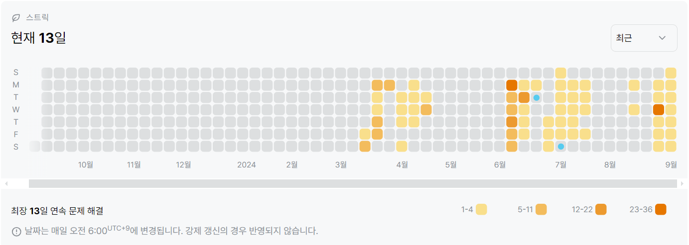

2166번: 다각형의 면적 (골드 5)
| 시간 제한 | 메모리 제한 |
|:-----:|:------:|
|  2초   | 128MB  |

## 문제
2차원 평면상에 N(3 ≤ N ≤ 10,000)개의 점으로 이루어진 다각형이 있다. 이 다각형의 면적을 구하는 프로그램을 작성하시오.


## 문제 설명
```text
1. 신발끈 공식을 이용하여, 각 좌표의 값을 입력받은 뒤 면적을 출력한다.
```

## 입력
첫째 줄에 N이 주어진다. 다음 N개의 줄에는 다각형을 이루는 순서대로 N개의 점의 x, y좌표가 주어진다. 좌표값은 절댓값이 100,000을 넘지 않는 정수이다.
## 출력
첫째 줄에 면적을 출력한다. 면적을 출력할 때에는 소수점 아래 둘째 자리에서 반올림하여 첫째 자리까지 출력한다.


## 예제 입력 1 
```text
4
0 0
0 10
10 10
10 0
```
## 예제 출력 1 
```text
100.0
```


## 코드
```python
import sys
input = sys.stdin.readline

N = int(input().rstrip())
c = [list(map(int, input().rstrip().split())) for _ in range(N)]
c.append(c[0])

print(round(0.5*(abs(sum([c[i][0] * c[i + 1][1] for i in range(N)]) - sum([c[i][1] * c[i + 1][0] for i in range(N)]))), 1))
```

## 채점 결과


## 스트릭
