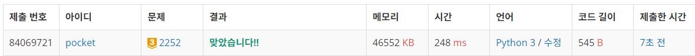
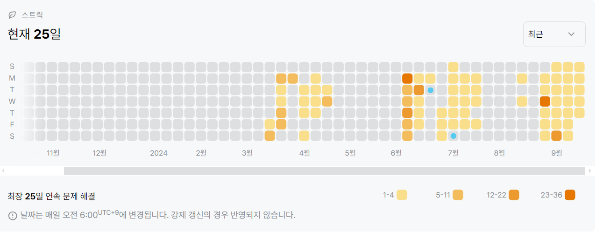

2252번: 줄 세우기 (골드 3)
| 시간 제한 | 메모리 제한 |
|:-----:|:------:|
|  2초   | 128MB  |

## 문제
N명의 학생들을 키 순서대로 줄을 세우려고 한다. 각 학생의 키를 직접 재서 정렬하면 간단하겠지만, 마땅한 방법이 없어서 두 학생의 키를 비교하는 방법을 사용하기로 하였다. 그나마도 모든 학생들을 다 비교해 본 것이 아니고, 일부 학생들의 키만을 비교해 보았다.

일부 학생들의 키를 비교한 결과가 주어졌을 때, 줄을 세우는 프로그램을 작성하시오.


## 문제 설명
```text
1. 위상 정렬 기초 문제이다.
2. res에 값을 하나씩 더하는데 조건은 다음과 같다.
    1) 들어오는 간선이 없는 노드를 res에 추가한다.
    2) 해당 노드에서 다음에 갈 수 있는 노드들을 확인하고, 다음 노드로 가는 간선을 제거한다.
    3) 간선이 제거된 후에 다음 노드로 갈 수 있는 간선의 개수가 0개라면 q에 추가한다.
    4) 끝날 때 까지 1)~3)을 반복한다.
```

## 입력
첫째 줄에 N(1 ≤ N ≤ 32,000), M(1 ≤ M ≤ 100,000)이 주어진다. M은 키를 비교한 회수이다. 다음 M개의 줄에는 키를 비교한 두 학생의 번호 A, B가 주어진다. 이는 학생 A가 학생 B의 앞에 서야 한다는 의미이다.

학생들의 번호는 1번부터 N번이다.

## 출력
첫째 줄에 학생들을 앞에서부터 줄을 세운 결과를 출력한다. 답이 여러 가지인 경우에는 아무거나 출력한다.


## 예제 입력 1 
```text
3 2
1 3
2 3
```
## 예제 출력 1 
```text
1 2 3
```

## 예제 입력 2
```text
4 2
4 2
3 1
```

```text
4 2 3 1
```


## 코드
```python
from collections import deque
import sys
input = sys.stdin.readline

N, M = map(int, input().rstrip().split())
tall = {i: {'cnt': 0, 'next': []} for i in range(1, N + 1)}

for _ in range(M):
    s, e = map(int, input().rstrip().split())
    tall[s]['next'].append(e)
    tall[e]['cnt'] += 1

q = deque([i for i in tall if tall[i]['cnt'] == 0])
res = []
while q:
    now = q.popleft()
    res.append(now)

    for next in tall[now]['next']:
        tall[next]['cnt'] -= 1
        if tall[next]['cnt'] == 0:
            q.append(next)

print(*res)
```

## 채점 결과


## 스트릭
