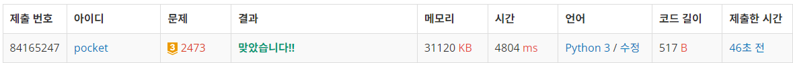

2473번: 세 용액 (골드 3)
| 시간 제한 | 메모리 제한 |
|:-----:|:------:|
|  1초   | 256MB  |

## 문제
KOI 부설 과학연구소에서는 많은 종류의 산성 용액과 알칼리성 용액을 보유하고 있다. 각 용액에는 그 용액의 특성을 나타내는 하나의 정수가 주어져있다.  산성 용액의 특성값은 1부터 1,000,000,000까지의 양의 정수로 나타내고, 알칼리성 용액의 특성값은 -1부터 -1,000,000,000까지의 음의 정수로 나타낸다.

같은 양의 세 가지 용액을 혼합한 용액의 특성값은 혼합에 사용된 각 용액의 특성값의 합으로 정의한다. 이 연구소에서는 같은 양의 세 가지 용액을 혼합하여 특성값이 0에 가장 가까운 용액을 만들려고 한다. 

예를 들어, 주어진 용액들의 특성값이 [-2, 6, -97, -6, 98]인 경우에는 특성값이 -97와 -2인 용액과 특성값이 98인 용액을 혼합하면 특성값이 -1인 용액을 만들 수 있고, 이 용액이 특성값이 0에 가장 가까운 용액이다. 참고로, 세 종류의 알칼리성 용액만으로나 혹은 세 종류의 산성 용액만으로 특성값이 0에 가장 가까운 혼합 용액을 만드는 경우도 존재할 수 있다.

산성 용액과 알칼리성 용액이 주어졌을 때, 이 중 같은 양의 세 개의 서로 다른 용액을 혼합하여 특성값이 0에 가장 가까운 용액을 만들어내는 세 용액을 찾는 프로그램을 작성하시오.

## 문제 설명
```text
1. 숫자 리스트를 입력받는다.
2. for문으로 가장 왼쪽 인덱스를 지정해두고, 나머지 값들에 대해서 투포인터를 활용한다.
3. 더한 값의 절대값이 가장 작으면 저장한다.
4. 저장한 값이 0이면 break한다.
5. 가장 작지 않으면, 더한 값이 양수인 경우 rear를 1 감소, 그렇지 않으면 front를 1 증가 한다. 
```

## 입력
첫째 줄에는 전체 용액의 수 N이 입력된다. N은 3 이상 5,000 이하의 정수이다. 둘째 줄에는 용액의 특성값을 나타내는 N개의 정수가 빈칸을 사이에 두고 주어진다. 이 수들은 모두 -1,000,000,000 이상 1,000,000,000 이하이다. N개의 용액들의 특성값은 모두 다르고, 산성 용액만으로나 알칼리성 용액만으로 입력이 주어지는 경우도 있을 수 있다.

## 출력
첫째 줄에 특성값이 0에 가장 가까운 용액을 만들어내는 세 용액의 특성값을 출력한다. 출력해야하는 세 용액은 특성값의 오름차순으로 출력한다. 특성값이 0에 가장 가까운 용액을 만들어내는 경우가 두 개 이상일 경우에는 그 중 아무것이나 하나를 출력한다.


## 예제 입력 1 
```text
5
-2 6 -97 -6 98
```
## 예제 출력 1 
```text
-97 -2 98
```

## 예제 입력 2
```text
7
-2 -3 -24 -6 98 100 61
```

## 예제 출력 2
```text
-6 -3 -2
```


## 코드
```python
import sys
input = sys.stdin.readline

N = int(input().rstrip())
nums = list(map(int, input().rstrip().split()))
nums.sort()

_sum = float('inf')
sel = None

for i in range(N - 2):
    front, rear = i + 1, N - 1
    while front < rear:
        s = nums[i] + nums[front] + nums[rear]
        if abs(s) < abs(_sum):
            _sum = s
            sel = (nums[i], nums[front], nums[rear])

        if s < 0:
            front += 1
        elif s > 0:
            rear -= 1
        else:
            break

print(*sel)
```

## 채점 결과


## 스트릭
