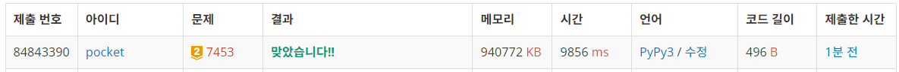
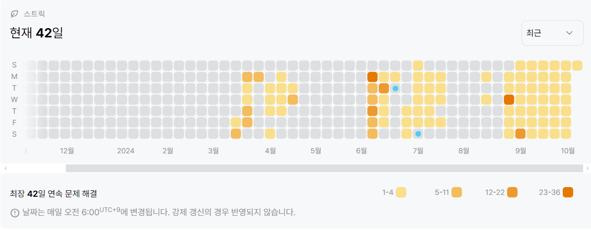

7453번: 합이 0인 네 정수 (골드 2)
| 시간 제한 | 메모리 제한 |
|:-----:|:------:|
|  12초   | 1024MB  |

## 문제
정수로 이루어진 크기가 같은 배열 A, B, C, D가 있다.

A[a], B[b], C[c], D[d]의 합이 0인 (a, b, c, d) 쌍의 개수를 구하는 프로그램을 작성하시오.

## 문제 설명
```text
1. A와 B의 숫자들로 만들 수 있는 모든 경우의수를 딕셔너리에 저장한다. 이 때 해당 경우의수가 등장한 횟수를 저장한다.
2. C와 D의 숫자로 만들 수 있는 경우의수에 -1 을 곱한 값이 딕셔너리에 있는지 확인하고, 있다면 해당 값이 등장한 횟수를 결과값에 더한다.
```

## 입력
첫째 줄에 배열의 크기 n (1 ≤ n ≤ 4000)이 주어진다. 다음 n개 줄에는 A, B, C, D에 포함되는 정수가 공백으로 구분되어져서 주어진다. 배열에 들어있는 정수의 절댓값은 최대 228이다.

## 출력
합이 0이 되는 쌍의 개수를 출력한다.


## 예제 입력 1 
```text
6
-45 22 42 -16
-41 -27 56 30
-36 53 -37 77
-36 30 -75 -46
26 -38 -10 62
-32 -54 -6 45
```
## 예제 출력 1 
```text
5
```


## 코드
```python
import sys
input = sys.stdin.readline

N = int(input().rstrip())
nums = [list(map(int, input().rstrip().split())) for _ in range(N)]

d = {}

for i in range(N):
    for j in range(N):
        buf = nums[i][0] + nums[j][1]
        if buf in d:
            d[buf] += 1
        else:
            d[buf] = 1

res = 0

for i in range(N):
    for j in range(N):
        buf = -1 * (nums[i][2] + nums[j][3])
        if buf in d:
            res += d[buf]

print(res)

```

## 채점 결과


## 스트릭
