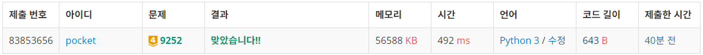
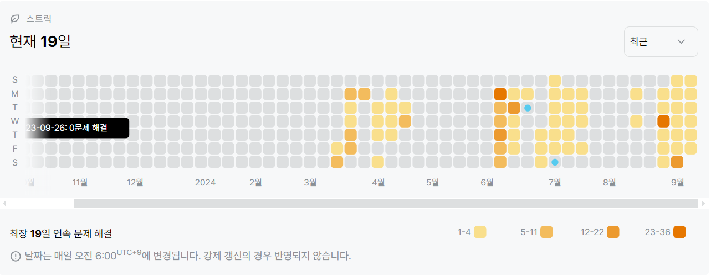

9252번: LCS 2 (골드 4)
| 시간 제한 | 메모리 제한 |
|:-----:|:------:|
|  (python 3) 2초   | 256MB  |

## 문제
LCS(Longest Common Subsequence, 최장 공통 부분 수열)문제는 두 수열이 주어졌을 때, 모두의 부분 수열이 되는 수열 중 가장 긴 것을 찾는 문제이다.

예를 들어, ACAYKP와 CAPCAK의 LCS는 ACAK가 된다.


## 문제 설명
```text
1. dp문제이다.
2. 같은 문자열이 나온다면 dp[x - 1][y - 1] + 1, 그렇지 않다면 max(dp[x - 1][y], dp[x][y - 1])로 채워나간다.
3. 가장 마지막 인덱스의 값이 가장 긴 길이이다.
4. 마지막 인덱스부터, 자기자신과 같은 값을 가진 칸으로 이동하며 문자를 한 글자씩 추가한다.
5. 0인 칸으로 이동했다면 종료하고 정답을 출력한다.
```

## 입력
첫째 줄과 둘째 줄에 두 문자열이 주어진다. 문자열은 알파벳 대문자로만 이루어져 있으며, 최대 1000글자로 이루어져 있다.


## 출력
첫째 줄에 입력으로 주어진 두 문자열의 LCS의 길이를, 둘째 줄에 LCS를 출력한다.

LCS가 여러 가지인 경우에는 아무거나 출력하고, LCS의 길이가 0인 경우에는 둘째 줄을 출력하지 않는다.


## 예제 입력 1 
```text
ACAYKP
CAPCAK
```
## 예제 출력 1 
```text
4
ACAK
```

## 코드
```python
import sys
input = sys.stdin.readline

A = list(input().rstrip())
B = list(input().rstrip())

dp = [[0 for _ in range(len(A) + 1)] for _ in range(len(B) + 1)]

for i in range(1, len(B) + 1):
    for j in range(1, len(A) + 1):
        if A[j - 1] == B[i - 1]:
            dp[i][j] = dp[i - 1][j - 1] + 1
        else:
            dp[i][j] = max(dp[i - 1][j], dp[i][j - 1])

x, y = len(B), len(A)
res = ''
while dp[x][y] != 0:
    if dp[x - 1][y] == dp[x][y]:
        x -= 1
    elif dp[x][y - 1] == dp[x][y]:
        y -= 1
    else:
        res += B[x - 1]
        x -= 1
        y -= 1

print(dp[-1][-1])
print(''.join(list(reversed(res))))
```

## 채점 결과


## 스트릭
