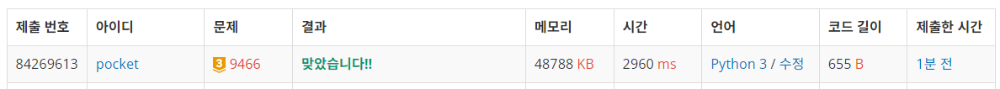
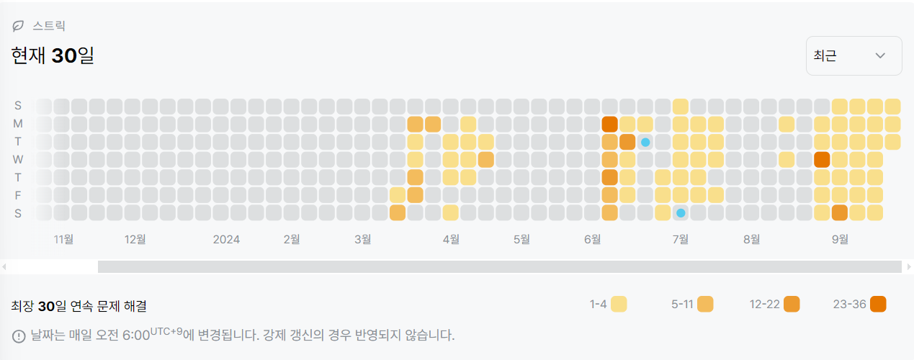

9466번: 텀 프로젝트 (골드 3)
| 시간 제한 | 메모리 제한 |
|:-----:|:------:|
|  3초   | 256MB  |

## 문제
이번 가을학기에 '문제 해결' 강의를 신청한 학생들은 텀 프로젝트를 수행해야 한다. 프로젝트 팀원 수에는 제한이 없다. 심지어 모든 학생들이 동일한 팀의 팀원인 경우와 같이 한 팀만 있을 수도 있다. 프로젝트 팀을 구성하기 위해, 모든 학생들은 프로젝트를 함께하고 싶은 학생을 선택해야 한다. (단, 단 한 명만 선택할 수 있다.) 혼자 하고 싶어하는 학생은 자기 자신을 선택하는 것도 가능하다.

학생들이(s1, s2, ..., sr)이라 할 때, r=1이고 s1이 s1을 선택하는 경우나, s1이 s2를 선택하고, s2가 s3를 선택하고,..., sr-1이 sr을 선택하고, sr이 s1을 선택하는 경우에만 한 팀이 될 수 있다.

예를 들어, 한 반에 7명의 학생이 있다고 하자. 학생들을 1번부터 7번으로 표현할 때, 선택의 결과는 다음과 같다.

1	2	3	4	5	6	7
3	1	3	7	3	4	6
위의 결과를 통해 (3)과 (4, 7, 6)이 팀을 이룰 수 있다. 1, 2, 5는 어느 팀에도 속하지 않는다.

주어진 선택의 결과를 보고 어느 프로젝트 팀에도 속하지 않는 학생들의 수를 계산하는 프로그램을 작성하라.


## 문제 설명
```text
1. dfs를 통해 순환이 있는지 확인하는 문제이다.
2. 순환이 있다면, 해당 인덱스부터의 인원수를 전부 더한다
3. 전체 인원수에서 순환 인원수를 빼 팀을 이루지 못한 인원수를 구한다.
```

## 입력
첫째 줄에 테스트 케이스의 개수 T가 주어진다. 각 테스트 케이스의 첫 줄에는 학생의 수가 정수 n (2 ≤ n ≤ 100,000)으로 주어진다. 각 테스트 케이스의 둘째 줄에는 선택된 학생들의 번호가 주어진다. (모든 학생들은 1부터 n까지 번호가 부여된다.)


## 출력
각 테스트 케이스마다 한 줄에 출력하고, 각 줄에는 프로젝트 팀에 속하지 못한 학생들의 수를 나타내면 된다.


## 예제 입력 1 
```text
2
7
3 1 3 7 3 4 6
8
1 2 3 4 5 6 7 8
```
## 예제 출력 1 
```text
3
0
```

## 코드
```python
import sys
input = sys.stdin.readline

for _ in range(int(input().rstrip())):
    N = int(input().rstrip())
    team = [0] + list(map(int, input().rstrip().split()))
    visited = [0 for _ in range(N + 1)]
    res = 0

    for i in range(1, N + 1):
        if not visited[i]:
            stack = [i]

            while True:
                visited[stack[-1]] = True
                next = team[stack[-1]]
                if visited[next] == True:
                    if next in stack:
                        res += len(stack[stack.index(next):])
                    break
                else:
                    stack.append(next)

    print(N - res)

```

## 채점 결과


## 스트릭
