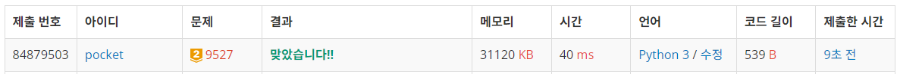

9527번: 1의 개수 세기 (골드 2)
| 시간 제한 | 메모리 제한 |
|:-----:|:------:|
|  1초   | 128MB  |

## 문제
두 자연수 A, B가 주어졌을 때, A ≤ x ≤ B를 만족하는 모든 x에 대해 x를 이진수로 표현했을 때 1의 개수의 합을 구하는 프로그램을 작성하시오.

즉, f(x) = x를 이진수로 표현 했을 때 1의 개수라고 정의하고, 아래 식의 결과를 구하자.

 
\[\sum_{x=A}^{B}{f(x)}\] 


## 문제 설명
```text
1. 진짜 너무 어려워서 인터넷 글들을 참고했따...
2. 비트가 늘어날 때 마다의 1의 개수를 누적합으로 구한다. 2진수의 규칙을 참고하면 식을 금방 세울 수 있다.
3. 2의 제곱수가 아닌 수들은 자기보다 작은 2의 제곱수의 1의 개수 + 자기자신 - 자기보다 작은 2의 제곱수 + 1 + 남은 1의 개수 로 구할 수 있다....
4. start에서의 1의 개수와 end에서의 1의 개수의 차를 출력한다.
5. 이 문제는 다음에 다시 공부해야겠다..,,,
```

## 입력
첫 줄에 두 자연수 A, B가 주어진다. (1 ≤ A ≤ B ≤ 1016)


## 출력
1의 개수를 세어 출력한다.


## 예제 입력 1 
```text
2 12
```
## 예제 출력 1 
```text
21
```

## 코드
```python
import sys
input = sys.stdin.readline

start, end = map(int, input().rstrip().split())
table = [0 for _ in range(57)]

for i in range(1, len(table)):
    table[i] = 2**(i - 1) + (2 * table[i - 1])


def count(num):
    global table
    cnt = 0
    bin_num = bin(num)[2:]
    length = len(bin_num)
    for i in range(length):
        if bin_num[i] == '1':
            val = length-i-1
            cnt += table[val]
            cnt += (num - 2**val + 1)
            num = num - 2 ** val
    return cnt


print(count(end) - count(start - 1))
```

## 채점 결과


## 스트릭
