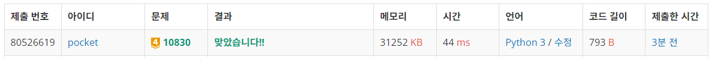

# 10830번: 행렬 제곱 (골드 4)
| 시간 제한 | 메모리 제한 |
|:-----:|:------:|
|  1초   | 256MB  |

## 문제
크기가 N*N인 행렬 A가 주어진다. 이때, A의 B제곱을 구하는 프로그램을 작성하시오. 수가 매우 커질 수 있으니, A^B의 각 원소를 1,000으로 나눈 나머지를 출력한다.

## 문제 설명
```text
1. 입력받은 행렬을 제곱한다.
2. 분할 정복을 이용하여 제곱을 진행한다.
3. n이 짝수인경우 그냥 제곱, 홀수인 경우 한 번 곱하고 제곱하는 재귀함수를 작성하여 제곱한다.
4. n이 1인경우 모든 원소를 1000으로 나눈 나머지로 변환한 뒤 반환한다.
```

## 입력
첫째 줄에 행렬의 크기 N과 B가 주어진다. (2 ≤ N ≤  5, 1 ≤ B ≤ 100,000,000,000)

둘째 줄부터 N개의 줄에 행렬의 각 원소가 주어진다. 행렬의 각 원소는 1,000보다 작거나 같은 자연수 또는 0이다.

## 출력
첫째 줄부터 N개의 줄에 걸쳐 행렬 A를 B제곱한 결과를 출력한다.


## 예제 입력 1 
```text
2 5
1 2
3 4
```
## 예제 출력 1 
```text
69 558
337 406
```

## 예제 입력 2 
```text
69 558
337 406
```
## 예제 출력 2 
```text
468 576 684
62 305 548
656 34 412
```

## 예제 입력 3
```text
5 10
1 0 0 0 1
1 0 0 0 1
1 0 0 0 1
1 0 0 0 1
1 0 0 0 1
```

## 예제 출력 3
```text
512 0 0 0 512
512 0 0 0 512
512 0 0 0 512
512 0 0 0 512
512 0 0 0 512
```


## 코드
```python
import sys
input = sys.stdin.readline


def matmul(A, B):

    res = [[0 for _ in range(len(A))] for _ in range(len(A))]
    for i in range(len(A)):
        for j in range(len(B)):
            for k in range(len(A)):
                res[i][j] += A[i][k] * B[k][j]
            res[i][j] %= 1000
    return res


N, B = map(int, input().rstrip().split())
matrix = [list(map(int, input().rstrip().split())) for _ in range(N)]

def power(matrix, n):
    if n == 1:
        for i in range(N):
            for j in range(N):
                matrix[i][j] %= 1000
        return matrix
    else:
        m = power(matrix, n // 2)
        if n % 2 == 0:
            return matmul(m, m)
        else:
            return matmul(matmul(m, m), matrix)


res = power(matrix, B)

for r in res:
    print(*r)

```

## 채점 결과


## 스트릭

