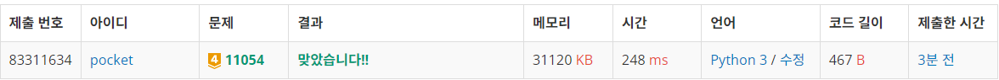
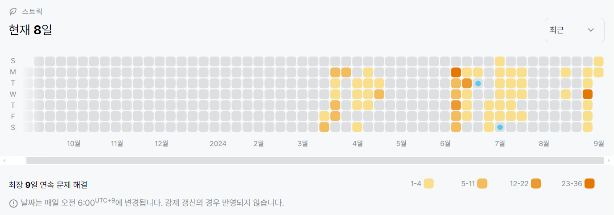

# 11054번: 가장 긴 바이토닉 부분 수열 (골드 4)
| 시간 제한 | 메모리 제한 |
|:-----:|:------:|
|  1초   | 256MB  |

## 문제
수열 S가 어떤 수 Sk를 기준으로 S1 < S2 < ... Sk-1 < Sk > Sk+1 > ... SN-1 > SN을 만족한다면, 그 수열을 바이토닉 수열이라고 한다.

예를 들어, {10, 20, 30, 25, 20}과 {10, 20, 30, 40}, {50, 40, 25, 10} 은 바이토닉 수열이지만, {1, 2, 3, 2, 1, 2, 3, 2, 1}과 {10, 20, 30, 40, 20, 30} 은 바이토닉 수열이 아니다.

수열 A가 주어졌을 때, 그 수열의 부분 수열 중 바이토닉 수열이면서 가장 긴 수열의 길이를 구하는 프로그램을 작성하시오.

## 문제 설명
```text
1. 가장 긴 증가하는 부분수열에 대한 정보를 정방향/역방향 모두 구한다.
2. 정방향은 0부터, 역방향은 N - 1번 인덱스부터 시작하여 두 값의 합의 최대값을 구한다.
3. 최대값에서 1을 빼준다. 정방향, 역방향의 인덱스는 사실 같은 위치의 값을 가리키기 때문에 중복 카운트를 제거해야 하기 때문.
4. 출력하라.
```

## 입력
첫째 줄에 수열 A의 크기 N이 주어지고, 둘째 줄에는 수열 A를 이루고 있는 Ai가 주어진다. (1 ≤ N ≤ 1,000, 1 ≤ Ai ≤ 1,000)


## 출력
첫째 줄에 수열 A의 부분 수열 중에서 가장 긴 바이토닉 수열의 길이를 출력한다.


## 예제 입력 1 
```text
10
1 5 2 1 4 3 4 5 2 1
```
## 예제 출력 1 
```text
7
```


## 코드
```python
import sys
input = sys.stdin.readline

N = int(input().rstrip())
A = list(map(int, input().rstrip().split()))
B = list(reversed(A))
dp_A = [1 for _ in range(N)]
dp_B = [1 for _ in range(N)]


for i in range(N):
    for j in range(i):
        if A[i] > A[j]:
            dp_A[i] = max(dp_A[i], dp_A[j] + 1)
        if B[i] > B[j]:
            dp_B[i] = max(dp_B[i], dp_B[j] + 1)

res = 0
for i in range(N):
    res = max(res, dp_A[i] + dp_B[N - 1 - i] - 1)

print(res)
```

## 채점 결과


## 스트릭
