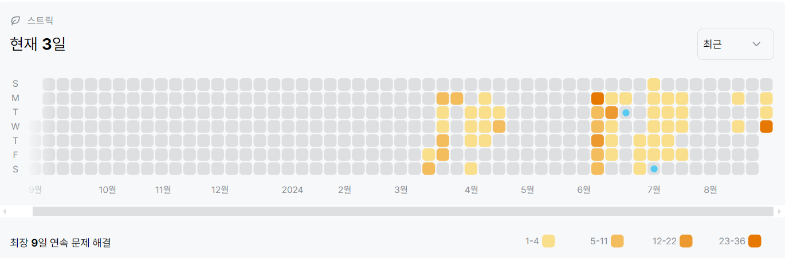

# 1167번: 트리의 지름(골드 2)
| 시간 제한 | 메모리 제한 |
|:-----:|:------:|
|  2초   | 256MB  |

## 문제
트리의 지름이란, 트리에서 임의의 두 점 사이의 거리 중 가장 긴 것을 말한다. 트리의 지름을 구하는 프로그램을 작성하시오.

## 문제 설명
```text
트리가 입력으로 주어진다. 먼저 첫 번째 줄에서는 트리의 정점의 개수 V가 주어지고 (2 ≤ V ≤ 100,000)둘째 줄부터 V개의 줄에 걸쳐 간선의 정보가 다음과 같이 주어진다. 정점 번호는 1부터 V까지 매겨져 있다.

먼저 정점 번호가 주어지고, 이어서 연결된 간선의 정보를 의미하는 정수가 두 개씩 주어지는데, 하나는 정점번호, 다른 하나는 그 정점까지의 거리이다. 예를 들어 네 번째 줄의 경우 정점 3은 정점 1과 거리가 2인 간선으로 연결되어 있고, 정점 4와는 거리가 3인 간선으로 연결되어 있는 것을 보여준다. 각 줄의 마지막에는 -1이 입력으로 주어진다. 주어지는 거리는 모두 10,000 이하의 자연수이다.
```

## 입력
첫째 줄에 사람의 수 N과 파티의 수 M이 주어진다.

둘째 줄에는 이야기의 진실을 아는 사람의 수와 번호가 주어진다. 진실을 아는 사람의 수가 먼저 주어지고 그 개수만큼 사람들의 번호가 주어진다. 사람들의 번호는 1부터 N까지의 수로 주어진다.

셋째 줄부터 M개의 줄에는 각 파티마다 오는 사람의 수와 번호가 같은 방식으로 주어진다.

N, M은 50 이하의 자연수이고, 진실을 아는 사람의 수는 0 이상 50 이하의 정수, 각 파티마다 오는 사람의 수는 1 이상 50 이하의 정수이다.

## 출력
첫째 줄에 트리의 지름을 출력한다.


## 예제 입력 1 
```text
5
1 3 2 -1
2 4 4 -1
3 1 2 4 3 -1
4 2 4 3 3 5 6 -1
5 4 6 -1
```
## 예제 출력 1 
```text
11
```

## 코드
```python
from collections import deque
import sys

input = sys.stdin.readline

N = int(input().rstrip())
graph = {i: {} for i in range(N)}

for _ in range(N):
    buf = list(map(int, input().rstrip().split()))
    node = buf[0] - 1
    for i in range(1, len(buf) - 1, 2):
        target = buf[i] - 1
        weight = buf[i + 1]
        graph[node][target] = weight
        graph[target][node] = weight


def bfs(start):
    dist = [-1] * N
    dist[start] = 0
    queue = deque([start])
    max_dist, max_node = 0, start

    while queue:
        node = queue.popleft()
        for next_node, d in graph[node].items():
            if dist[next_node] == -1:
                dist[next_node] = dist[node] + d
                queue.append(next_node)
                if dist[next_node] > max_dist:
                    max_dist = dist[next_node]
                    max_node = next_node

    return max_node, max_dist

farthest_node, _ = bfs(0)
_, diameter = bfs(farthest_node)
print(diameter)

```

## 채점 결과


## 스트릭 (또는 자신이 매일 문제를 풀었다는 증거)

