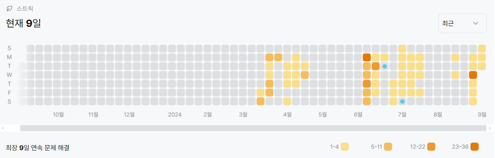

114502번: 연구소 (골드 4)
| 시간 제한 | 메모리 제한 |
|:-----:|:------:|
|  2초   | 512MB  |

## 문제
인체에 치명적인 바이러스를 연구하던 연구소에서 바이러스가 유출되었다. 다행히 바이러스는 아직 퍼지지 않았고, 바이러스의 확산을 막기 위해서 연구소에 벽을 세우려고 한다.

연구소는 크기가 N×M인 직사각형으로 나타낼 수 있으며, 직사각형은 1×1 크기의 정사각형으로 나누어져 있다. 연구소는 빈 칸, 벽으로 이루어져 있으며, 벽은 칸 하나를 가득 차지한다. 

일부 칸은 바이러스가 존재하며, 이 바이러스는 상하좌우로 인접한 빈 칸으로 모두 퍼져나갈 수 있다. 새로 세울 수 있는 벽의 개수는 3개이며, 꼭 3개를 세워야 한다.

예를 들어, 아래와 같이 연구소가 생긴 경우를 살펴보자.

2 0 0 0 1 1 0
0 0 1 0 1 2 0
0 1 1 0 1 0 0
0 1 0 0 0 0 0
0 0 0 0 0 1 1
0 1 0 0 0 0 0
0 1 0 0 0 0 0
이때, 0은 빈 칸, 1은 벽, 2는 바이러스가 있는 곳이다. 아무런 벽을 세우지 않는다면, 바이러스는 모든 빈 칸으로 퍼져나갈 수 있다.

2행 1열, 1행 2열, 4행 6열에 벽을 세운다면 지도의 모양은 아래와 같아지게 된다.

2 1 0 0 1 1 0
1 0 1 0 1 2 0
0 1 1 0 1 0 0
0 1 0 0 0 1 0
0 0 0 0 0 1 1
0 1 0 0 0 0 0
0 1 0 0 0 0 0
바이러스가 퍼진 뒤의 모습은 아래와 같아진다.

2 1 0 0 1 1 2
1 0 1 0 1 2 2
0 1 1 0 1 2 2
0 1 0 0 0 1 2
0 0 0 0 0 1 1
0 1 0 0 0 0 0
0 1 0 0 0 0 0
벽을 3개 세운 뒤, 바이러스가 퍼질 수 없는 곳을 안전 영역이라고 한다. 위의 지도에서 안전 영역의 크기는 27이다.

연구소의 지도가 주어졌을 때 얻을 수 있는 안전 영역 크기의 최댓값을 구하는 프로그램을 작성하시오.


## 문제 설명
```text
1. dfs와 bfs를 혼합하여 해결하는 문제이다.
2. dfs를 통해 3개의 벽을 선택하고, 3개가 선택 된 시점에서 bfs를 수행하여 오염되지 않은 구역의 수를 구한다.
3. 구한들의 최대값을 출력한다.
```

## 입력
첫째 줄에 지도의 세로 크기 N과 가로 크기 M이 주어진다. (3 ≤ N, M ≤ 8)

둘째 줄부터 N개의 줄에 지도의 모양이 주어진다. 0은 빈 칸, 1은 벽, 2는 바이러스가 있는 위치이다. 2의 개수는 2보다 크거나 같고, 10보다 작거나 같은 자연수이다.

빈 칸의 개수는 3개 이상이다.

## 출력
첫째 줄에 얻을 수 있는 안전 영역의 최대 크기를 출력한다.


## 예제 입력 1 
```text
7 7
2 0 0 0 1 1 0
0 0 1 0 1 2 0
0 1 1 0 1 0 0
0 1 0 0 0 0 0
0 0 0 0 0 1 1
0 1 0 0 0 0 0
0 1 0 0 0 0 0
```
## 예제 출력 1 
```text
27
```

## 예제 입력 2 
```text
4 6
0 0 0 0 0 0
1 0 0 0 0 2
1 1 1 0 0 2
0 0 0 0 0 2
```
## 예제 출력 2 
```text
9
```

## 예제 입력 3 
```text
8 8
2 0 0 0 0 0 0 2
2 0 0 0 0 0 0 2
2 0 0 0 0 0 0 2
2 0 0 0 0 0 0 2
2 0 0 0 0 0 0 2
0 0 0 0 0 0 0 0
0 0 0 0 0 0 0 0
0 0 0 0 0 0 0 0
```
## 예제 출력 3 
```text
3
```


## 코드
```python
from collections import deque
import sys
input = sys.stdin.readline

N, M = map(int, input().rstrip().split())
board = [list(map(int, input().rstrip().split())) for _ in range(N)]
start = [(i, j) for i in range(N) for j in range(M) if board[i][j] == 2]

def bfs():
    q = deque(start)
    visited = [[False for _ in range(M)] for _ in range(N)]
    for i, j in start:
        visited[i][j] = True
    while q:
        x, y = q.popleft()
        for dx, dy in [(-1, 0), (1, 0), (0, -1), (0, 1)]:
            nx, ny = x + dx, y + dy
            if 0 <= nx < N and 0 <= ny < M:
                if not visited[nx][ny] and board[nx][ny] == 0:
                    q.append((nx, ny))
                    visited[nx][ny] = True
    res = sum([1 for i in range(N) for j in range(M) if board[i][j] == 0 and not visited[i][j]])
    return res


ans = 0
def dfs(cnt):
    global ans
    if cnt == 3:
        ans = max(ans, bfs())
    else:
        for i in range(N):
            for j in range(M):
                if board[i][j] == 0:
                    board[i][j] = 1
                    dfs(cnt + 1)
                    board[i][j] = 0

dfs(0)
print(ans)

```

## 채점 결과


## 스트릭
