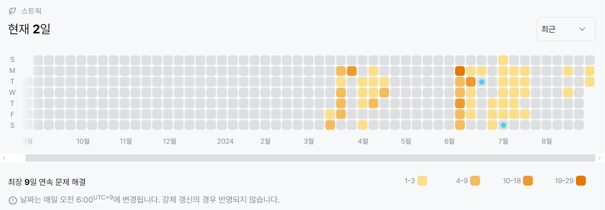

# 14938번: 서강그라운드 (골드 4)
| 시간 제한 | 메모리 제한 |
|:-----:|:------:|
|  1초   | 128MB  |

## 문제
예은이는 요즘 가장 인기가 있는 게임 서강그라운드를 즐기고 있다. 서강그라운드는 여러 지역중 하나의 지역에 낙하산을 타고 낙하하여, 그 지역에 떨어져 있는 아이템들을 이용해 서바이벌을 하는 게임이다. 서강그라운드에서 1등을 하면 보상으로 치킨을 주는데, 예은이는 단 한번도 치킨을 먹을 수가 없었다. 자신이 치킨을 못 먹는 이유는 실력 때문이 아니라 아이템 운이 없어서라고 생각한 예은이는 낙하산에서 떨어질 때 각 지역에 아이템 들이 몇 개 있는지 알려주는 프로그램을 개발을 하였지만 어디로 낙하해야 자신의 수색 범위 내에서 가장 많은 아이템을 얻을 수 있는지 알 수 없었다.

각 지역은 일정한 길이 l (1 ≤ l ≤ 15)의 길로 다른 지역과 연결되어 있고 이 길은 양방향 통행이 가능하다. 예은이는 낙하한 지역을 중심으로 거리가 수색 범위 m (1 ≤ m ≤ 15) 이내의 모든 지역의 아이템을 습득 가능하다고 할 때, 예은이가 얻을 수 있는 아이템의 최대 개수를 알려주자.


주어진 필드가 위의 그림과 같고, 예은이의 수색범위가 4라고 하자. ( 원 밖의 숫자는 지역 번호, 안의 숫자는 아이템 수, 선 위의 숫자는 거리를 의미한다) 예은이가 2번 지역에 떨어지게 되면 1번,2번(자기 지역), 3번, 5번 지역에 도달할 수 있다. (4번 지역의 경우 가는 거리가 3 + 5 = 8 > 4(수색범위) 이므로 4번 지역의 아이템을 얻을 수 없다.) 이렇게 되면 예은이는 23개의 아이템을 얻을 수 있고, 이는 위의 필드에서 예은이가 얻을 수 있는 아이템의 최대 개수이다.

## 문제 설명
```text
1. 예은이가 갈 수 있는 지역의 그래프를 저장한다. 
2. 다익스트라 알고리즘을 통해, 각 지역을 시작점으로 하여 갈 수 있는 거리의 최소값들을 구한 뒤, 예은이의 수색범위 내에 해당하는 지역의 아이템 수만 합산하여 최대값을 구한다.
```

## 입력
첫째 줄에는 지역의 개수 n (1 ≤ n ≤ 100)과 예은이의 수색범위 m (1 ≤ m ≤ 15), 길의 개수 r (1 ≤ r ≤ 100)이 주어진다.

둘째 줄에는 n개의 숫자가 차례대로 각 구역에 있는 아이템의 수 t (1 ≤ t ≤ 30)를 알려준다.

세 번째 줄부터 r+2번째 줄 까지 길 양 끝에 존재하는 지역의 번호 a, b, 그리고 길의 길이 l (1 ≤ l ≤ 15)가 주어진다.

지역의 번호는 1이상 n이하의 정수이다. 두 지역의 번호가 같은 경우는 없다.


## 출력
예은이가 얻을 수 있는 최대 아이템 개수를 출력한다.


## 예제 입력 1 
```text
5 5 4
5 7 8 2 3
1 4 5
5 2 4
3 2 3
1 2 3
```

## 예제 출력 1 
```text
23
```

## 코드
```python
import heapq
import sys
input = sys.stdin.readline

n, m, r = map(int, input().rstrip().split())
items = list(map(int, input().rstrip().split()))
graph = [[float('inf') if i != j else 0 for j in range(n)] for i in range(n)]

for _ in range(r):
    a, b, c = map(int, input().rstrip().split())
    graph[a - 1][b - 1] = min(graph[a - 1][b - 1], c)
    graph[b - 1][a - 1] = min(graph[b - 1][a - 1], c)

def dijkstra(start):
    distance = [float('inf') for i in range(n)]
    heap = []
    heapq.heappush(heap, (0, start))
    distance[start] = 0
    while heap:
        dist, now = heapq.heappop(heap)
        if distance[now] < dist:
            continue
        for i in range(n):
            cost = dist + graph[now][i]
            if cost < distance[i]:
                distance[i] = cost
                heapq.heappush(heap, (cost, i))
    return distance

answer = 0
for i in range(n):
    buf = dijkstra(i)
    answer = max(answer, sum([items[i] for i in range(len(buf)) if buf[i] <= m]))

print(answer)

```

## 채점 결과


## 스트릭
