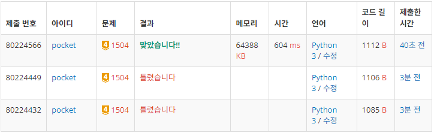

# 1504번: 특정한 최단 경로(골드 4)
| 시간 제한 | 메모리 제한 |
|:-----:|:------:|
|  1초   | 256MB  |

## 문제
방향성이 없는 그래프가 주어진다. 세준이는 1번 정점에서 N번 정점으로 최단 거리로 이동하려고 한다. 또한 세준이는 두 가지 조건을 만족하면서 이동하는 특정한 최단 경로를 구하고 싶은데, 그것은 바로 임의로 주어진 두 정점은 반드시 통과해야 한다는 것이다.

세준이는 한번 이동했던 정점은 물론, 한번 이동했던 간선도 다시 이동할 수 있다. 하지만 반드시 최단 경로로 이동해야 한다는 사실에 주의하라. 1번 정점에서 N번 정점으로 이동할 때, 주어진 두 정점을 반드시 거치면서 최단 경로로 이동하는 프로그램을 작성하시오.

## 문제 설명
```text
1. 그래프의 정보를 저장한다.
2. 반드시 지나야하는 노드 정보를 저장한다.
3. 다익스트라를 진행한다.
    - 반드시 지나야하는 노드를 각각 n1, n2라 할 때 아래 두 경우 전부 다익스트라 진행한다.
        a) 1 -> n1 -> n2 -> N
        b) 1 -> n2 -> n1 -> N
4. 더 작은 값을 출력하고, 더 작은 값이 없고 float('inf')라면, -1을 출력한다.
```

## 입력
첫째 줄에 정점의 개수 N과 간선의 개수 E가 주어진다. (2 ≤ N ≤ 800, 0 ≤ E ≤ 200,000) 둘째 줄부터 E개의 줄에 걸쳐서 세 개의 정수 a, b, c가 주어지는데, a번 정점에서 b번 정점까지 양방향 길이 존재하며, 그 거리가 c라는 뜻이다. (1 ≤ c ≤ 1,000) 다음 줄에는 반드시 거쳐야 하는 두 개의 서로 다른 정점 번호 v1과 v2가 주어진다. (v1 ≠ v2, v1 ≠ N, v2 ≠ 1) 임의의 두 정점 u와 v사이에는 간선이 최대 1개 존재한다.

## 출력
첫째 줄에 두 개의 정점을 지나는 최단 경로의 길이를 출력한다. 그러한 경로가 없을 때에는 -1을 출력한다.


## 예제 입력 1 
```text
4 6
1 2 3
2 3 3
3 4 1
1 3 5
2 4 5
1 4 4
2 3
```
## 예제 출력 1 
```text
7
```

## 코드
```python
import heapq
import sys
input = sys.stdin.readline

N, E = map(int, input().rstrip().split())
graph = {i: [] for i in range(1, N + 1)}
for _ in range(E):
    a, b, c = map(int, input().rstrip().split())
    graph[a].append((b, c))
    graph[b].append((a, c))

node1, node2 = map(int, input().rstrip().split())

def dijkstra(graph, start, end):
    distances = [float('inf')] * (N + 1)
    distances[start] = 0
    q = []
    heapq.heappush(q, [0, start])

    while q:
        curr_dist, curr_dest = heapq.heappop(q)
        if distances[curr_dest] < curr_dist:
            continue

        for new_dest, new_dist in graph[curr_dest]:
            dist = curr_dist + new_dist
            if dist < distances[new_dest]:
                distances[new_dest] = dist
                heapq.heappush(q, [dist, new_dest])

    return distances[end]

distance1 = dijkstra(graph, 1, node1) + dijkstra(graph, node1, node2) + dijkstra(graph, node2, N)
distance2 = dijkstra(graph, 1, node2) + dijkstra(graph, node2, node1) + dijkstra(graph, node1, N)
res = min(distance1, distance2)
print(-1 if res == float('inf') else res)

```

## 채점 결과


## 스트릭

