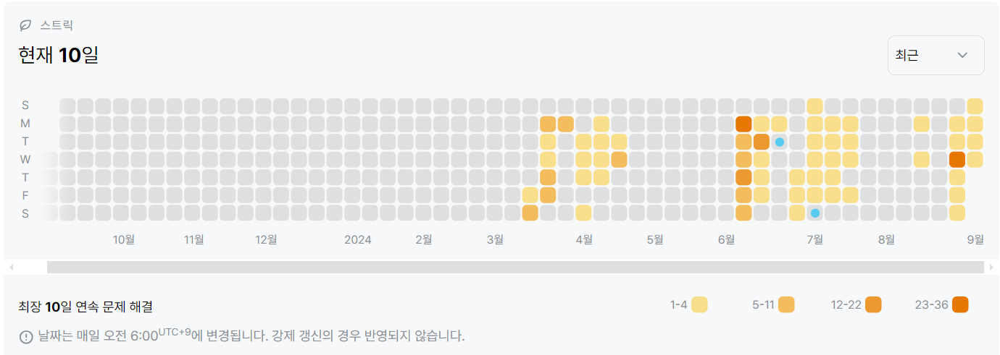

17144번: 미세먼지 안녕! (골드 4)
| 시간 제한 | 메모리 제한 |
|:-----:|:------:|
|  1초   | 512MB  |

## 문제
미세먼지를 제거하기 위해 구사과는 공기청정기를 설치하려고 한다. 공기청정기의 성능을 테스트하기 위해 구사과는 집을 크기가 R×C인 격자판으로 나타냈고, 1×1 크기의 칸으로 나눴다. 구사과는 뛰어난 코딩 실력을 이용해 각 칸 (r, c)에 있는 미세먼지의 양을 실시간으로 모니터링하는 시스템을 개발했다. (r, c)는 r행 c열을 의미한다.


공기청정기는 항상 1번 열에 설치되어 있고, 크기는 두 행을 차지한다. 공기청정기가 설치되어 있지 않은 칸에는 미세먼지가 있고, (r, c)에 있는 미세먼지의 양은 Ar,c이다.

1초 동안 아래 적힌 일이 순서대로 일어난다.

미세먼지가 확산된다. 확산은 미세먼지가 있는 모든 칸에서 동시에 일어난다.
(r, c)에 있는 미세먼지는 인접한 네 방향으로 확산된다.
인접한 방향에 공기청정기가 있거나, 칸이 없으면 그 방향으로는 확산이 일어나지 않는다.
확산되는 양은 Ar,c/5이고 소수점은 버린다. 즉, ⌊Ar,c/5⌋이다.
(r, c)에 남은 미세먼지의 양은 Ar,c - ⌊Ar,c/5⌋×(확산된 방향의 개수) 이다.
공기청정기가 작동한다.
공기청정기에서는 바람이 나온다.
위쪽 공기청정기의 바람은 반시계방향으로 순환하고, 아래쪽 공기청정기의 바람은 시계방향으로 순환한다.
바람이 불면 미세먼지가 바람의 방향대로 모두 한 칸씩 이동한다.
공기청정기에서 부는 바람은 미세먼지가 없는 바람이고, 공기청정기로 들어간 미세먼지는 모두 정화된다.
다음은 확산의 예시이다.


왼쪽과 위쪽에 칸이 없기 때문에, 두 방향으로만 확산이 일어났다.


인접한 네 방향으로 모두 확산이 일어난다.


공기청정기가 있는 칸으로는 확산이 일어나지 않는다.

공기청정기의 바람은 다음과 같은 방향으로 순환한다.


방의 정보가 주어졌을 때, T초가 지난 후 구사과의 방에 남아있는 미세먼지의 양을 구해보자.

## 문제 설명
```text
1. BFS로 미세먼지를 확산 시킨다.
2. 공청기의 바람이 지나가는 부분을 한 칸씩 당기며 진횅한다.
3. 다 더한값 + 2 출력 (공청기 -1을 상쇄)
```

## 입력
첫째 줄에 R, C, T (6 ≤ R, C ≤ 50, 1 ≤ T ≤ 1,000) 가 주어진다.

둘째 줄부터 R개의 줄에 Ar,c (-1 ≤ Ar,c ≤ 1,000)가 주어진다. 공기청정기가 설치된 곳은 Ar,c가 -1이고, 나머지 값은 미세먼지의 양이다. -1은 2번 위아래로 붙어져 있고, 가장 윗 행, 아랫 행과 두 칸이상 떨어져 있다.

## 출력
첫째 줄에 T초가 지난 후 구사과 방에 남아있는 미세먼지의 양을 출력한다.


## 예제 입력 1 
```text
7 8 1
0 0 0 0 0 0 0 9
0 0 0 0 3 0 0 8
-1 0 5 0 0 0 22 0
-1 8 0 0 0 0 0 0
0 0 0 0 0 10 43 0
0 0 5 0 15 0 0 0
0 0 40 0 0 0 20 0
```
## 예제 출력 1 
```text
188
```

## 예제 입력 2 
```text
7 8 2
0 0 0 0 0 0 0 9
0 0 0 0 3 0 0 8
-1 0 5 0 0 0 22 0
-1 8 0 0 0 0 0 0
0 0 0 0 0 10 43 0
0 0 5 0 15 0 0 0
0 0 40 0 0 0 20 0
```
## 예제 출력 2 
```text
188
```

## 예제 입력 3 
```text
7 8 3
0 0 0 0 0 0 0 9
0 0 0 0 3 0 0 8
-1 0 5 0 0 0 22 0
-1 8 0 0 0 0 0 0
0 0 0 0 0 10 43 0
0 0 5 0 15 0 0 0
0 0 40 0 0 0 20 0
```
## 예제 출력 3 
```text
186
```

## 예제 입력 4 
```text
7 8 4
0 0 0 0 0 0 0 9
0 0 0 0 3 0 0 8
-1 0 5 0 0 0 22 0
-1 8 0 0 0 0 0 0
0 0 0 0 0 10 43 0
0 0 5 0 15 0 0 0
0 0 40 0 0 0 20 0
```
## 예제 출력 4 
```text
178
```

## 예제 입력 5 
```text
7 8 5
0 0 0 0 0 0 0 9
0 0 0 0 3 0 0 8
-1 0 5 0 0 0 22 0
-1 8 0 0 0 0 0 0
0 0 0 0 0 10 43 0
0 0 5 0 15 0 0 0
0 0 40 0 0 0 20 0
```
## 예제 출력 5 
```text
172
```

## 예제 입력 6 
```text
7 8 20
0 0 0 0 0 0 0 9
0 0 0 0 3 0 0 8
-1 0 5 0 0 0 22 0
-1 8 0 0 0 0 0 0
0 0 0 0 0 10 43 0
0 0 5 0 15 0 0 0
0 0 40 0 0 0 20 0
```
## 예제 출력 6 
```text
71
```

## 예제 입력 7 
```text
7 8 30
0 0 0 0 0 0 0 9
0 0 0 0 3 0 0 8
-1 0 5 0 0 0 22 0
-1 8 0 0 0 0 0 0
0 0 0 0 0 10 43 0
0 0 5 0 15 0 0 0
0 0 40 0 0 0 20 0
```
## 예제 출력 7 
```text
52
```

## 예제 입력 8 
```text
7 8 50
0 0 0 0 0 0 0 9
0 0 0 0 3 0 0 8
-1 0 5 0 0 0 22 0
-1 8 0 0 0 0 0 0
0 0 0 0 0 10 43 0
0 0 5 0 15 0 0 0
0 0 40 0 0 0 20 0
```
## 예제 출력 8 
```text
46
```


## 코드
```python
from collections import deque
import sys
input = sys.stdin.readline

N, M, T = map(int, input().rstrip().split())
grid = [list(map(int, input().rstrip().split())) for _ in range(N)]
air_pu = [(i, j) for i in range(N) for j in range(M) if grid[i][j] == -1]

for _ in range(T):
    q = deque([(i, j) for i in range(N) for j in range(M) if grid[i][j] not in [-1, 0]])
    res = []
    while q:
        x, y = q.popleft()
        can_go = []
        for dx, dy in [(-1, 0), (1, 0), (0, -1), (0, 1)]:
            nx, ny = x + dx, y + dy
            if 0 <= nx < N and 0 <= ny < M:
                if grid[nx][ny] != -1:
                    can_go.append((nx, ny))
        for nx, ny in can_go:
            res.append((nx, ny, grid[x][y] // 5))
        grid[x][y] -= (grid[x][y] // 5) * len(can_go)
    for i, j, cost in res:
        grid[i][j] += cost
    grid[air_pu[0][0] - 1][0] = 0
    for i in range(air_pu[0][0] - 1, 0, -1):
        grid[i][0] = grid[i - 1][0]
        grid[i - 1][0] = 0
    for i in range(M - 1):
        grid[0][i] = grid[0][i + 1]
        grid[0][i + 1] = 0
    for i in range(air_pu[0][0]):
        grid[i][-1] = grid[i + 1][-1]
        grid[i + 1][-1] = 0
    for i in range(M - 1, 1, -1):
        grid[air_pu[0][0]][i] = grid[air_pu[0][0]][i - 1]
        grid[air_pu[0][0]][i - 1] = 0

    grid[air_pu[1][0] + 1][0] = 0
    for i in range(air_pu[1][0] + 1, N - 1):
        grid[i][0] = grid[i + 1][0]
        grid[i + 1][0] = 0
    for i in range(M - 1):
        grid[-1][i] = grid[-1][i + 1]
        grid[-1][i + 1] = 0
    for i in range(N - 1, air_pu[1][0], -1):
        grid[i][-1] = grid[i - 1][-1]
        grid[i - 1][-1] = 0
    for i in range(M - 1, 1, -1):
        grid[air_pu[1][0]][i] = grid[air_pu[1][0]][i - 1]
        grid[air_pu[1][0]][i - 1] = 0

print(sum([sum(grid[i]) for i in range(N)]) + 2)


```

## 채점 결과


## 스트릭
