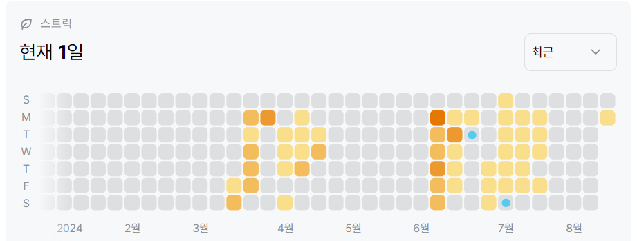

# 2638번: 치즈 (골드 3)
| 시간 제한 | 메모리 제한 |
|:-----:|:------:|
|  1초   | 128MB  |

## 문제
N×M의 모눈종이 위에 아주 얇은 치즈가 <그림 1>과 같이 표시되어 있다. 단, N 은 세로 격자의 수이고, M 은 가로 격자의 수이다. 이 치즈는 냉동 보관을 해야만 하는데 실내온도에 내어놓으면 공기와 접촉하여 천천히 녹는다. 그런데 이러한 모눈종이 모양의 치즈에서 각 치즈 격자(작 은 정사각형 모양)의 4변 중에서 적어도 2변 이상이 실내온도의 공기와 접촉한 것은 정확히 한시간만에 녹아 없어져 버린다. 따라서 아래 <그림 1> 모양과 같은 치즈(회색으로 표시된 부분)라면 C로 표시된 모든 치즈 격자는 한 시간 후에 사라진다.


<그림 1>

<그림 2>와 같이 치즈 내부에 있는 공간은 치즈 외부 공기와 접촉하지 않는 것으로 가정한다. 그러므 로 이 공간에 접촉한 치즈 격자는 녹지 않고 C로 표시된 치즈 격자만 사라진다. 그러나 한 시간 후, 이 공간으로 외부공기가 유입되면 <그림 3>에서와 같이 C로 표시된 치즈 격자들이 사라지게 된다.


<그림 2>


<그림 3>

모눈종이의 맨 가장자리에는 치즈가 놓이지 않는 것으로 가정한다. 입력으로 주어진 치즈가 모두 녹아 없어지는데 걸리는 정확한 시간을 구하는 프로그램을 작성하시오.

## 문제 설명
```text
1. 치즈의 가장자리를 탐색하고 계속 유지하는것이 아니라 공기만 계속 탐색한다.
2. 공기를 bfs로 탐색하며 만나는 치즈마다 +1을 해준다.
3. 탐색이 끝난 후 값이 3 이상인 값들을 0으로, 1이상 3미만인 값들을 1로 다시 재설정한다.
4. res변수를 1 증가한다.
5. 위 과정을 모든 치즈가 사라질 때 까지 반복한 뒤, 모든 치즈가 사라지면 res변수를 출력한다.
```

## 입력
첫째 줄에는 모눈종이의 크기를 나타내는 두 개의 정수 N, M (5 ≤ N, M ≤ 100)이 주어진다. 그 다음 N개의 줄에는 모눈종이 위의 격자에 치즈가 있는 부분은 1로 표시되고, 치즈가 없는 부분은 0으로 표시된다. 또한, 각 0과 1은 하나의 공백으로 분리되어 있다.

## 출력
출력으로는 주어진 치즈가 모두 녹아 없어지는데 걸리는 정확한 시간을 정수로 첫 줄에 출력한다.


## 예제 입력 1 
```text
8 9
0 0 0 0 0 0 0 0 0
0 0 0 1 1 0 0 0 0
0 0 0 1 1 0 1 1 0
0 0 1 1 1 1 1 1 0
0 0 1 1 1 1 1 0 0
0 0 1 1 0 1 1 0 0
0 0 0 0 0 0 0 0 0
0 0 0 0 0 0 0 0 0
```
## 예제 출력 1 
```text
4
```


## 코드
```python
from collections import deque
import sys
input = sys.stdin.readline

N, M = map(int, input().rstrip().split())
cheese = [list(map(int, input().rstrip().split())) for _ in range(N)]

res = 0

def find_side():
    q = deque([(0, 0)])
    visited = [[False for _ in range(M)] for _ in range(N)]
    visited[0][0] = True
    while q:
        x, y = q.popleft()

        for dx, dy in [(1, 0), (-1, 0), (0, 1), (0, -1)]:
            nx = x + dx
            ny = y + dy
            if 0 <= nx < N and 0 <= ny < M:
                if cheese[nx][ny] == 0:
                    if not visited[nx][ny]:
                        visited[nx][ny] = True
                        q.append((nx, ny))
                elif cheese[nx][ny] >= 1:
                    cheese[nx][ny] += 1

res = 0
while True:
    find_side()
    for i in range(N):
        for j in range(M):
            if cheese[i][j] >= 3:
                cheese[i][j] = 0
            elif 0 < cheese[i][j] <= 2:
                cheese[i][j] = 1
    res += 1
    if sum([sum(c) for c in cheese]) == 0:
        break

print(res)

```

## 채점 결과


## 스트릭
