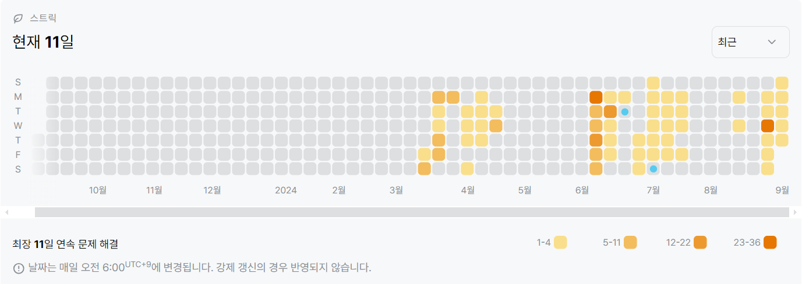

30805번: 사전 순 최대 공통 부분 수열 (골드 4)
| 시간 제한 | 메모리 제한 |
|:-----:|:------:|
|  1초   | 1024MB  |

## 문제
어떤 수열이 다른 수열의 부분 수열이라는 것은 다음을 의미합니다.

해당 수열의 원소들이 다른 수열 내에서 순서대로 등장합니다.
예를 들어, 
$\{1,1,5\}$는  
  
  
 
$\{3,\underline{\color{blue} 1} ,4,\underline{\color{blue} 1} ,\underline{\color{blue} 5} ,9\}$의 부분 수열이지만, 
$\{1,5,1\}$의 부분 수열은 아닙니다.
또한, 어떤 수열이 다른 수열보다 사전 순으로 나중이라는 것은 다음을 의미합니다.

두 수열 중 첫 번째 수가 큰 쪽은 사전 순으로 나중입니다.
두 수열의 첫 번째 수가 같다면, 첫 번째 수를 빼고 두 수열을 다시 비교했을 때 사전 순으로 나중인 쪽이 사전 순으로 나중입니다.
길이가 
$0$인 수열과 다른 수열을 비교하면, 다른 수열이 사전 순으로 나중입니다.
양의 정수로 이루어진 길이가 
$N$인 수열 
$\{A_1,\cdots ,A_N\}$이 주어집니다. 마찬가지로 양의 정수로 이루어진 길이가 
$M$인 수열 
$\{B_1,\cdots ,B_M\}$이 주어집니다.

수열 
$A$와 수열 
$B$가 공통으로 갖는 부분 수열들 중 사전 순으로 가장 나중인 것을 구하세요.


## 문제 설명
```text
1. 두 수열에서 최대값을 찾는다.
2. 일치하면 정답에 추가하고, 각각 해당 수 뒤의 리스트만 이용하여 처음으로 돌아간다.
3. 일치하지 않는다면, 더 큰 쪽의 값을 제거하고 다시 처음으로 돌아가 반복하낟.
4. 두 리스트 중 하나라도 빌 때 까지 반복한다.
```

## 입력
첫 줄에 수열 
$A$의 길이 
$N$이 주어집니다. 
$(1 \le N \le 100)$ 

둘째 줄에 
$N$개의 양의 정수 
$A_1,A_2,\cdots,A_N$이 주어집니다. 
$(1 \le A_i \le 100)$ 

셋째 줄에 수열 
$B$의 길이 
$M$이 주어집니다. 
$(1 \le M \le 100)$ 

넷째 줄에 
$M$개의 양의 정수 
$B_1,B_2,\cdots,B_M$이 주어집니다. 
$(1 \le B_i \le 100)$ 

## 출력
 
$A$와 
$B$의 공통 부분 수열 중 사전 순으로 가장 나중인 수열의 크기 
$K$를 출력하세요.

 
$K \ne 0$이라면, 다음 줄에 
$K$개의 수를 공백으로 구분해 출력하세요. 
$i$번째 수는 
$A$와 
$B$의 공통 부분 수열 중 사전 순으로 가장 나중인 수열의 
$i$번째 수입니다.

## 예제 입력 1 
```text
4
1 9 7 3
5
1 8 7 5 3
```
## 예제 출력 1 
```text
2
7 3
```


## 코드
```python
import sys
input = sys.stdin.readline

N = int(input().rstrip())
num_a = list(map(int, input().rstrip().split()))
M = int(input().rstrip())
num_b = list(map(int, input().rstrip().split()))

res = []
while True:

    if not num_a or not num_b:
        break

    idx_a = num_a.index(max(num_a))
    idx_b = num_b.index(max(num_b))

    if num_a[idx_a] == num_b[idx_b]:
        res.append(num_a[idx_a])
        num_a = num_a[idx_a + 1:]
        num_b = num_b[idx_b + 1:]
    elif num_a[idx_a] > num_b[idx_b]:
        num_a.pop(idx_a)
    else:
        num_b.pop(idx_b)


print(len(res))
print(*res)

```

## 채점 결과


## 스트릭
 