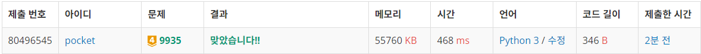

# 9935번: 문자열 폭발 (골드 4)
| 시간 제한 | 메모리 제한 |
|:-----:|:------:|
|  2초   | 128MB  |

## 문제
상근이는 문자열에 폭발 문자열을 심어 놓았다. 폭발 문자열이 폭발하면 그 문자는 문자열에서 사라지며, 남은 문자열은 합쳐지게 된다.

폭발은 다음과 같은 과정으로 진행된다.

문자열이 폭발 문자열을 포함하고 있는 경우에, 모든 폭발 문자열이 폭발하게 된다. 남은 문자열을 순서대로 이어 붙여 새로운 문자열을 만든다.
새로 생긴 문자열에 폭발 문자열이 포함되어 있을 수도 있다.
폭발은 폭발 문자열이 문자열에 없을 때까지 계속된다.
상근이는 모든 폭발이 끝난 후에 어떤 문자열이 남는지 구해보려고 한다. 남아있는 문자가 없는 경우가 있다. 이때는 "FRULA"를 출력한다.

폭발 문자열은 같은 문자를 두 개 이상 포함하지 않는다.

## 문제 설명
```text
1. 입력받은 문자열을 스택에 하나씩 append한다.
2. 스택의 뒤부터 n글자가 폭발 문자열과 동일하면 n번 pop한다.
```

## 입력
첫째 줄에 문자열이 주어진다. 문자열의 길이는 1보다 크거나 같고, 1,000,000보다 작거나 같다.

둘째 줄에 폭발 문자열이 주어진다. 길이는 1보다 크거나 같고, 36보다 작거나 같다.

두 문자열은 모두 알파벳 소문자와 대문자, 숫자 0, 1, ..., 9로만 이루어져 있다.


## 출력
첫째 줄에 모든 폭발이 끝난 후 남은 문자열을 출력한다.


## 예제 입력 1 
```text
mirkovC4nizCC44
C4
```
## 예제 출력 1 
```text
mirkovniz
```

## 예제 입력 1 
```text
12ab112ab2ab
12ab
```
## 예제 출력 1 
```text
FRULA
```


## 코드
```python
from collections import deque
import sys
input = sys.stdin.readline

S = deque(list(input().rstrip()))
boom = list(input().rstrip())
boom_length = len(boom)

stack = []

for s in S:
    stack.append(s)
    if stack[-boom_length:] == boom:
        for _ in range(boom_length):
            stack.pop()

print(''.join(stack) if stack else 'FRULA')


```

## 채점 결과


## 스트릭
