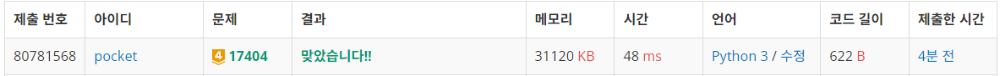
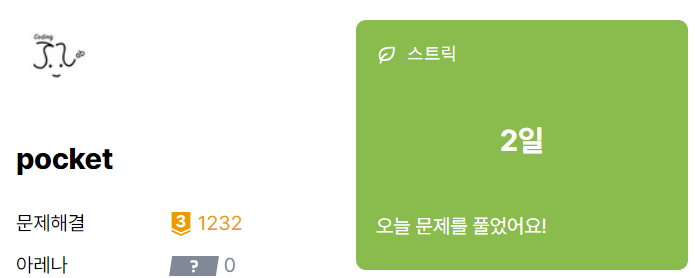

# 17404번: RGB거리 2 (골드 4)
| 시간 제한 | 메모리 제한 |
|:-----:|:------:|
| 0.5초  | 128MB  |

## 문제
RGB거리에는 집이 N개 있다. 거리는 선분으로 나타낼 수 있고, 1번 집부터 N번 집이 순서대로 있다.

집은 빨강, 초록, 파랑 중 하나의 색으로 칠해야 한다. 각각의 집을 빨강, 초록, 파랑으로 칠하는 비용이 주어졌을 때, 아래 규칙을 만족하면서 모든 집을 칠하는 비용의 최솟값을 구해보자.

1번 집의 색은 2번, N번 집의 색과 같지 않아야 한다.
N번 집의 색은 N-1번, 1번 집의 색과 같지 않아야 한다.
i(2 ≤ i ≤ N-1)번 집의 색은 i-1, i+1번 집의 색과 같지 않아야 한다.

## 문제 설명
```text
1. dp 점화식을 구한다.
2. rgb거리 1과 비슷하지만, 앞뒤 집과 다른 색을 칠해야한다는 조건이 추가되어 풀이가 약간 달라진다.
3. 맨 첫 집의 색을 r, g, b로 각각 고정하여 dp를 3회 진행한다. 
4. 3회 진행하면서 가장 작은 값을 출력한다.
```


## 입력
첫째 줄에 집의 수 N(2 ≤ N ≤ 1,000)이 주어진다. 둘째 줄부터 N개의 줄에는 각 집을 빨강, 초록, 파랑으로 칠하는 비용이 1번 집부터 한 줄에 하나씩 주어진다. 집을 칠하는 비용은 1,000보다 작거나 같은 자연수이다.

## 출력
첫째 줄에 모든 집을 칠하는 비용의 최솟값을 출력한다.


## 예제 입력 1 
```text
3
26 40 83
49 60 57
13 89 99
```

## 예제 출력 1 
```text
110
```

## 예제 입력 2 
```text
3
1 100 100
100 1 100
100 100 1
```

## 예제 출력 2 
```text
3
```

## 예제 입력 3 
```text
3
1 100 100
100 100 100
1 100 100
```

## 예제 출력 3 
```text
201
```

## 예제 입력 4 
```text
6
30 19 5
64 77 64
15 19 97
4 71 57
90 86 84
93 32 91
```

## 예제 출력 4 
```text
208
```

## 예제 입력 5 
```text
8
71 39 44
32 83 55
51 37 63
89 29 100
83 58 11
65 13 15
47 25 29
60 66 19
```

## 예제 출력 5 
```text
253
```


## 코드
```python
import sys
input = sys.stdin.readline

N = int(input().rstrip())
rgb = [list(map(int, input().rstrip().split())) for _ in range(N)]
rgb = [[-1, -1, -1]] + rgb

ans = float('inf')

for i in range(3):
    
    dp = [[0 for _ in range(3)] for _ in range(N + 1)]
    dp[1] = [float('inf'), float('inf'), float('inf')]
    dp[1][i] = rgb[1][i]
    
    for j in range(2, N + 1):
        
        dp[j][0] = min(dp[j - 1][1], dp[j - 1][2]) + rgb[j][0]
        dp[j][1] = min(dp[j - 1][0], dp[j - 1][2]) + rgb[j][1]
        dp[j][2] = min(dp[j - 1][0], dp[j - 1][1]) + rgb[j][2]
        
    dp[N][i] = float('inf')
    ans = min(ans, min(dp[-1]))
    
print(ans)
```

## 채점 결과


## 스트릭

