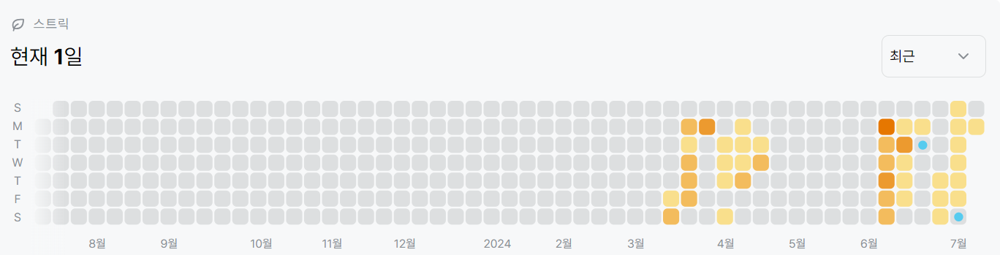

# 2293번: 동전 1 (골드 5)
| 시간 제한 | 메모리 제한 |
|:-----:|:------:|
| 0.5초  |  4MB   |

## 문제
n가지 종류의 동전이 있다. 각각의 동전이 나타내는 가치는 다르다. 이 동전을 적당히 사용해서, 그 가치의 합이 k원이 되도록 하고 싶다. 그 경우의 수를 구하시오. 각각의 동전은 몇 개라도 사용할 수 있다.

사용한 동전의 구성이 같은데, 순서만 다른 것은 같은 경우이다.


## 문제 설명
```text
1. dp 점화식을 구한다.

예제 입력을 예시로 들면, 동전의 value는 1, 2, 5이며 10원을 만들어야한다.

1원짜리로 10원을 만들 수 있는 경우는 다음과 같다.
```
|k|1|2|3|4|5|6|7|8|9|10|
|:---:|:---:|:---:|:---:|:---:|:---:|:---:|:---:|:---:|:---:|:---:|
|경우의수|1|1|1|1|1|1|1|1|1|1|
```text
1원, 2원짜리로 10원을 만들 수 있는 경우는 다음과 같다.
```
|k|1| 2 | 3 | 4 | 5 | 6 | 7 | 8 | 9 | 10 |
|:---:|:---:|:-:|:-:|:-:|:-:|:-:|:-:|:-:|:-:|:--:|
|경우의수|1| 2 | 2 | 3 | 3 | 4 | 4 | 5 | 5 | 6  |
```text
두 번째 표에서 3원을 만들 수 있는 경우는
1원짜리로 3원을 만드는 경우의수 + 1, 2원짜리로 1원을 만드는 경우의수와 같다.
즉, 현재 k'값을 만들 때 사용하는 동전의 값을 뺀 경우의수를 더한 값과 같다.

2. 점화식: dp[n] += dp[n - value[i]]
```


## 입력
첫째 줄에 n, k가 주어진다. (1 ≤ n ≤ 100, 1 ≤ k ≤ 10,000) 다음 n개의 줄에는 각각의 동전의 가치가 주어진다. 동전의 가치는 100,000보다 작거나 같은 자연수이다.

## 출력
첫째 줄에 경우의 수를 출력한다. 경우의 수는 231보다 작다.


## 예제 입력 1 
```text
3 10
1
2
5
```

## 예제 출력 1 
```text
10
```


## 코드
```python
import sys
input = sys.stdin.readline

n, k = map(int, input().rstrip().split())
value = [int(input().rstrip()) for _ in range(n)]
table = [0 for _ in range(k + 1)]
table[0] = 1

for i in range(n):
    for j in range(value[i], k + 1):
        table[j] += table[j - value[i]]

print(table[-1])

```

## 채점 결과


## 스트릭

