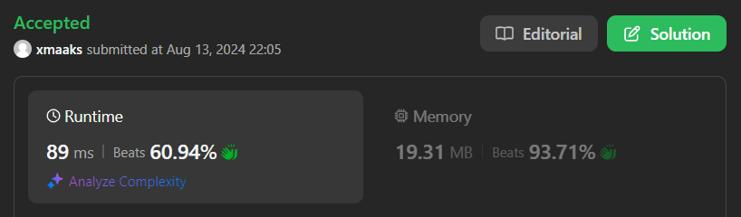
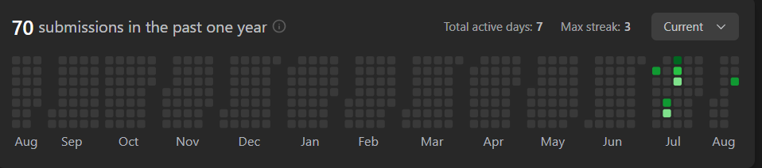

# Group-Anagram

## 문제
Given an array of strings strs, group the anagrams together. You can return the answer in any order.

An Anagram is a word or phrase formed by rearranging the letters of a different word or phrase, typically using all the original letters exactly once.

## 문제 설명
```text
1. 문자열을 순회하면서 정렬된 문자열을 방문한 적 있는지 확인하고, 추가한다.
2. values를 출력한다.
```

## Constraints:
1 <= strs.length <= 104
0 <= strs[i].length <= 100
strs[i] consists of lowercase English letters.

## 예제 입력 1 
```text
strs = ["eat","tea","tan","ate","nat","bat"]
```

## 예제 출력 1 
```text
[["bat"],["nat","tan"],["ate","eat","tea"]]
```

## 예제 입력 2
```text
strs = [""]
```

## 예제 출력 2
```text
[[""]]
```

## 예제 입력 3
```text
strs = ["a"]
```

## 예제 출력 3
```text
[["a"]]
```

## 코드
```python
class Solution:
    def groupAnagrams(self, strs: List[str]) -> List[List[str]]:
        res = {}
        for _str in strs:
            key = ''.join(list(sorted(_str)))
            try:
                res[key].append(_str)
            except:
                res[key] = [_str]
        return list(res.values())
```

## 최적화된 코드 (내 풀이 아님)
```python
class Solution:
    def groupAnagrams(self, strs: List[str]) -> List[List[str]]:
        anagram_map = defaultdict(list)
        
        for word in strs:
            sorted_word = ''.join(sorted(word))
            anagram_map[sorted_word].append(word)
        
        return list(anagram_map.values())
```

## 채점 결과


## 스트릭

