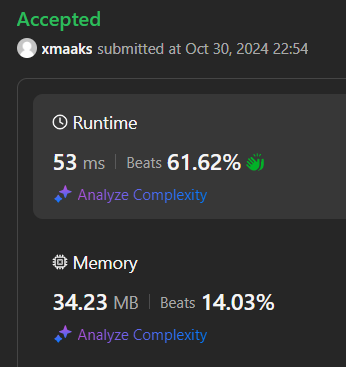
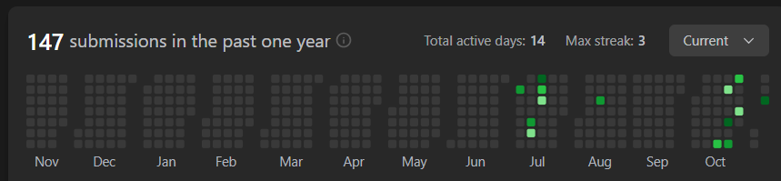

# Longest Consecutive Sequence

## 문제
Given an unsorted array of integers nums, return the length of the longest consecutive elements sequence.

You must write an algorithm that runs in O(n) time.


## Constraints:
0 <= nums.length <= 105
-109 <= nums[i] <= 109

## 예제 입력 1 
```text
nums = [100,4,200,1,3,2]
```

## 예제 출력 1 
```text
4
```

## 예제 입력 2
```text
nums = [0,3,7,2,5,8,4,6,0,1]
```

## 예제 출력 2
```text
9
```

## 코드
```python
class Solution:
    def longestConsecutive(self, nums: List[int]) -> int:
        
        if not nums:
            return 0

        nums = list(set(nums))
        num_set = set(nums)
        nums.sort()

        res = 0
        curr = 1

        for n in nums:
            if n - 1 not in num_set:
                curr = 1
            else:
                res = max(res, curr + 1)
                curr += 1

        res = max(res, curr)

        return res
```

## 채점 결과


## 스트릭

