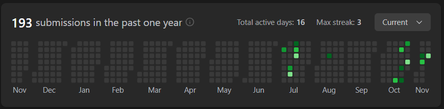

# Longest Substring Without Repeating Characters

## 문제
Given a string s, find the length of the longest substring without repeating characters.


## Constraints:
0 <= s.length <= 5 * 104
s consists of English letters, digits, symbols and spaces.

## Example 1:

Input: s = "abcabcbb"
Output: 3
Explanation: The answer is "abc", with the length of 3.


## Example 2:

Input: s = "bbbbb"
Output: 1
Explanation: The answer is "b", with the length of 1.


## Example 3:

Input: s = "pwwkew"
Output: 3
Explanation: The answer is "wke", with the length of 3.
Notice that the answer must be a substring, "pwke" is a subsequence and not a substring.
 
## 코드
```python
from collections import deque


class Solution:
    def lengthOfLongestSubstring(self, s: str) -> int:
        if not s:
            return 0

        used_set = set()
        used = deque()

        res = []

        for _s in s:
            while _s in used_set:
                used_set.remove(used.popleft())

            used_set.add(_s)
            used.append(_s)

            res.append(len(used))

        return max(res)
```

## 채점 결과


## 스트릭

