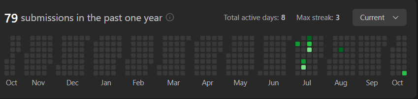

# Merge Two Sorted Lists

## 문제
You are given the heads of two sorted linked lists list1 and list2.

Merge the two lists into one sorted list. The list should be made by splicing together the nodes of the first two lists.

Return the head of the merged linked list.

## 문제 설명
```text
1. 연결리스트를 순회하면서 순서대로 값을 추가한다.
2. 순회가 끝난 후 남은 값을 추가한다.
```

## Constraints:
The number of nodes in both lists is in the range [0, 50].
-100 <= Node.val <= 100
Both list1 and list2 are sorted in non-decreasing order.

## 예제 입력 1 
```text
Input: list1 = [1,2,4], list2 = [1,3,4]
```

## 예제 출력 1 
```text
Output: [1,1,2,3,4,4]
```

## 예제 입력 2
```text
Input: list1 = [], list2 = []
```

## 예제 출력 2
```text
Output: []
```

## 예제 입력 3
```text
Input: list1 = [], list2 = [0]
```

## 예제 출력 3
```text
Output: [0]
```

## 코드
```python
# Definition for singly-linked list.
# class ListNode:
#     def __init__(self, val=0, next=None):
#         self.val = val
#         self.next = next
class Solution:
    def mergeTwoLists(self, list1: Optional[ListNode], list2: Optional[ListNode]) -> Optional[ListNode]:
        head = ListNode()
        now = head

        while list1 and list2:
            if list1.val < list2.val:
                now.next = list1
                list1 = list1.next
            else:
                now.next = list2
                list2 = list2.next
            now = now.next

        while list1:
            now.next = list1
            list1 = list1.next
            now = now.next

        while list2:
            now.next = list2
            list2 = list2.next
            now = now.next

        return head.next
```


## 채점 결과


## 스트릭

