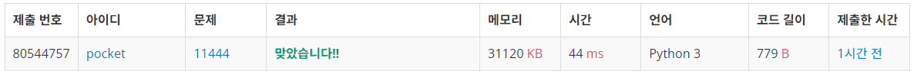

# 11444번: 피보나치 수 6 (골드 4)
| 시간 제한 | 메모리 제한 |
|:-----:|:------:|
|  1초   | 256MB  |

## 문제
피보나치 수는 0과 1로 시작한다. 0번째 피보나치 수는 0이고, 1번째 피보나치 수는 1이다. 그 다음 2번째 부터는 바로 앞 두 피보나치 수의 합이 된다.

이를 식으로 써보면 Fn = Fn-1 + Fn-2 (n ≥ 2)가 된다.

n=17일때 까지 피보나치 수를 써보면 다음과 같다.

0, 1, 1, 2, 3, 5, 8, 13, 21, 34, 55, 89, 144, 233, 377, 610, 987, 1597

n이 주어졌을 때, n번째 피보나치 수를 구하는 프로그램을 작성하시오.

## 문제 설명
```text
1. 초기 행렬을 N-2제곱한 뒤 시작 행렬과 곱한다.
```

## 입력
첫째 줄에 n이 주어진다. n은 1,000,000,000,000,000,000보다 작거나 같은 자연수이다.

## 출력
첫째 줄에 n번째 피보나치 수를 1,000,000,007으로 나눈 나머지를 출력한다.


## 예제 입력 1 
```text
1000
```

## 예제 출력 1 
```text
517691607
```


## 코드
```python
import sys
input = sys.stdin.readline


def matmul(A, B):

    res = [[0 for _ in range(len(A))] for _ in range(len(A))]
    for i in range(len(A)):
        for k in range(len(B[0])):
            for j in range(len(A)):
                res[i][k] += A[i][j] * B[j][k]
            res[i][k] %= 1000000007
    return res

def power(matrix, n):
    if n == 1:
        for i in range(2):
            for j in range(2):
                matrix[i][j] %= 1000
        return matrix
    else:
        m = power(matrix, n // 2)
        if n % 2 == 0:
            return matmul(m, m)
        else:
            return matmul(matmul(m, m), matrix)

N = int(input())
matrix = [[1, 1], [1, 0]]
start = [[1], [1]]
if N < 3:
    print(1)
else:
    print(matmul(power(matrix, N - 2), start)[0][0])


```

## 채점 결과


## 스트릭

