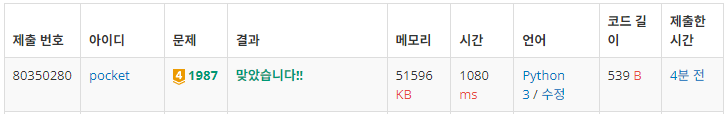
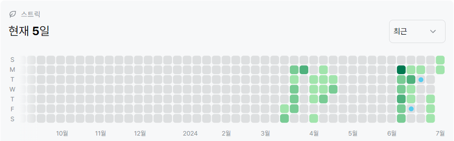

# 1987번: 알파벳(골드 4)
| 시간 제한 | 메모리 제한 |
|:-----:|:------:|
|  2초   | 256MB  |

## 문제
세로 
$R$칸, 가로 
$C$칸으로 된 표 모양의 보드가 있다. 보드의 각 칸에는 대문자 알파벳이 하나씩 적혀 있고, 좌측 상단 칸 ($1$행 $1$열) 에는 말이 놓여 있다.

말은 상하좌우로 인접한 네 칸 중의 한 칸으로 이동할 수 있는데, 새로 이동한 칸에 적혀 있는 알파벳은 지금까지 지나온 모든 칸에 적혀 있는 알파벳과는 달라야 한다. 즉, 같은 알파벳이 적힌 칸을 두 번 지날 수 없다.

좌측 상단에서 시작해서, 말이 최대한 몇 칸을 지날 수 있는지를 구하는 프로그램을 작성하시오. 말이 지나는 칸은 좌측 상단의 칸도 포함된다.


이런 두 노드 사이의 경로의 길이를 트리의 지름이라고 한다. 정확히 정의하자면 트리에 존재하는 모든 경로들 중에서 가장 긴 것의 길이를 말한다.

입력으로 루트가 있는 트리를 가중치가 있는 간선들로 줄 때, 트리의 지름을 구해서 출력하는 프로그램을 작성하시오. 아래와 같은 트리가 주어진다면 트리의 지름은 45가 된다.


트리의 노드는 1부터 n까지 번호가 매겨져 있다.

## 문제 설명
```text
1. 보드의 정보를 저장한다.
2. 보드의 0, 0을 시작지점으로 bfs를 진행한다.
    a) 방문했던 칸인지, 방문하지 않았더라도 이미 본 알파벳인지를 고려하여 set에 저장한다.
    b) python의 set의 경우, pop을 지원하며 hash방식으로 작동한다.
    c) 따라서 빠른 속도로 bfs를 진행할 수 있다.
3. bfs 진행 중 가장 길었던 경로의 값을 출력한다.
```

## 입력
첫째 줄에 $R$과 $C$가 빈칸을 사이에 두고 주어진다. ($1 ≤ R,C ≤ 20$) 둘째 줄부터 $R$개의 줄에 걸쳐서 보드에 적혀 있는 $C$개의 대문자 알파벳들이 빈칸 없이 주어진다.

## 출력
첫째 줄에 말이 지날 수 있는 최대의 칸 수를 출력한다.


## 예제 입력 1 
```text
2 4
CAAB
ADCB
```
## 예제 출력 1 
```text
3
```

## 예제 입력 2 
```text
3 6
HFDFFB
AJHGDH
DGAGEH
```
## 예제 출력 2 
```text
6
```

## 예제 입력 3 
```text
5 5
IEFCJ
FHFKC
FFALF
HFGCF
HMCHH
```
## 예제 출력 3 
```text
10
```

## 코드
```python
import sys
input = sys.stdin.readline

R, C = map(int, input().rstrip().split())
grid = [list(input().rstrip()) for _ in range(R)]

def bfs(_grid, x, y):
    res = 1
    q = set()
    q.add((x, y, _grid[x][y]))

    while q:
        x, y, s = q.pop()
        res = max(res, len(s))

        for dx, dy in [(0, -1), (0, 1), (-1, 0), (1, 0)]:
            nx, ny = x + dx, y + dy
            if 0 <= nx < R and 0 <= ny < C and _grid[nx][ny] not in s:
                q.add((nx, ny, s + _grid[nx][ny]))

    return res

print(bfs(grid, 0, 0))

```

## 채점 결과


## 스트릭
