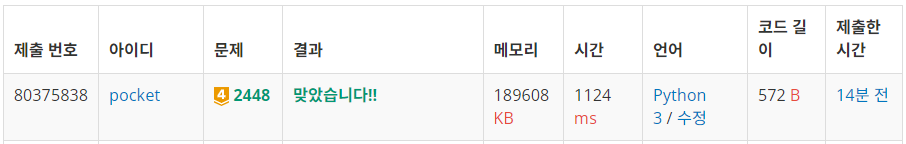
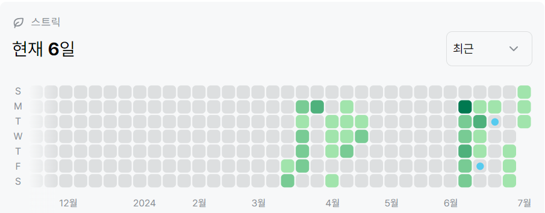

# 2448번: 별 찍기 - 11(골드 4)
| 시간 제한 | 메모리 제한 |
|:-----:|:------:|
|  1초   | 256MB  |

## 문제
예제를 보고 규칙을 유추한 뒤에 별을 찍어 보세요.

## 문제 설명
```text
1. 예제의 규칙을 찾는다.
2. 리스트를 생성한다.
3. 재귀적으로 패턴을 구현한다.
```

## 입력
첫째 줄에 N이 주어진다. N은 항상 3×2k 수이다. (3, 6, 12, 24, 48, ...) (0 ≤ k ≤ 10, k는 정수)

## 출력
첫째 줄부터 N번째 줄까지 별을 출력한다.


## 예제 입력 1 
```text
24
```
## 예제 출력 1 
```text
                       *                        
                      * *                       
                     *****                      
                    *     *                     
                   * *   * *                    
                  ***** *****                   
                 *           *                  
                * *         * *                 
               *****       *****                
              *     *     *     *               
             * *   * *   * *   * *              
            ***** ***** ***** *****             
           *                       *            
          * *                     * *           
         *****                   *****          
        *     *                 *     *         
       * *   * *               * *   * *        
      ***** *****             ***** *****       
     *           *           *           *      
    * *         * *         * *         * *     
   *****       *****       *****       *****    
  *     *     *     *     *     *     *     *   
 * *   * *   * *   * *   * *   * *   * *   * *  
***** ***** ***** ***** ***** ***** ***** *****
```


## 코드
```python
import sys
input = sys.stdin.readline

sys.setrecursionlimit(10**9)

N = int(input().rstrip())
grid = [[' ' for _ in range((N * 2) - 1)] for _ in range(N)]

def print_star(x, y, n):
    if n == 3:
        grid[x - 2][y - 2] = '*'
        for d in [-3, -1]:
            grid[x - 1][y + d] = '*'
        for d in [-4, -3, -2, -1, 0]:
            grid[x][y + d] = '*'
    else:
        print_star(x, y, n // 2)
        print_star(x - (n // 2), y - (n // 2), n // 2)
        print_star(x, y - n, n // 2)

print_star(N - 1, (N * 2) - 2, N)
for g in grid:
    print(''.join(g))


```

## 채점 결과


## 스트릭
