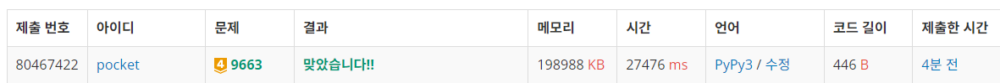
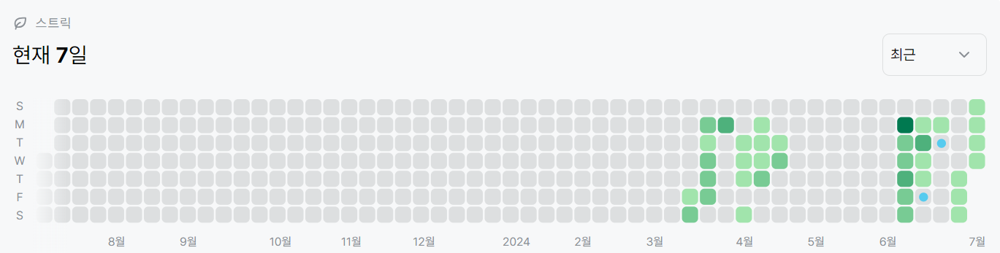

# 9663번: N-Queen (골드 4)
| 시간 제한 | 메모리 제한 |
|:-----:|:------:|
|  10초  | 128MB  |

## 문제
N-Queen 문제는 크기가 N × N인 체스판 위에 퀸 N개를 서로 공격할 수 없게 놓는 문제이다.

N이 주어졌을 때, 퀸을 놓는 방법의 수를 구하는 프로그램을 작성하시오.

## 문제 설명
```text
1. 각 라인마다 퀸을 하나씩 둔다고 생각하고 문제를 푼다.
2. 백트래킹을 진행하는데, 한 줄에 하나씩 퀸을 두도록 진행한다.
3. 퀸을 둘 수 있는 자리는 j의 값이 겹치지 않을 때, x - x', y - y'의 값이 서로 다를 때 이다.
4. 주어진 개수만큼 진행했다면 res에 1을 더하여 결과값을 만든다
5. res를 출력한다.
```

## 입력
첫째 줄에 N이 주어진다. (1 ≤ N < 15)

## 출력
첫째 줄에 퀸 N개를 서로 공격할 수 없게 놓는 경우의 수를 출력한다.


## 예제 입력 1 
```text
8
```
## 예제 출력 1 
```text
92
```


## 코드
```python
N = int(input())
grid = [0 for _ in range(N)]

res = 0


def can_set(x):
    for i in range(x):
        if grid[x] == grid[i] or abs(grid[x] - grid[i]) == abs(x - i):
            return False
    return True


def backtracking(x):
    global res
    if x == N:
        res += 1
        return
    else:
        for i in range(N):
            grid[x] = i
            if can_set(x):
                backtracking(x + 1)


backtracking(0)
print(res)

```

## 채점 결과


## 스트릭
