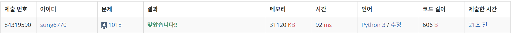
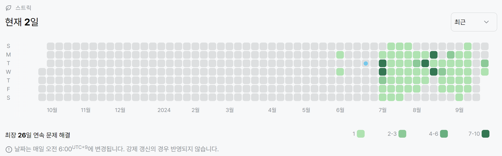

# 1018번: 체스판 칠하기(실버 4)
| 시간 제한 | 메모리 제한 |
|:-----:|:------:|
|  2초   | 128MB  |

## 문제
지민이는 자신의 저택에서 MN개의 단위 정사각형으로 나누어져 있는 M×N 크기의 보드를 찾았다. 어떤 정사각형은 검은색으로 칠해져 있고, 나머지는 흰색으로 칠해져 있다. 지민이는 이 보드를 잘라서 8×8 크기의 체스판으로 만들려고 한다.

체스판은 검은색과 흰색이 번갈아서 칠해져 있어야 한다. 구체적으로, 각 칸이 검은색과 흰색 중 하나로 색칠되어 있고, 변을 공유하는 두 개의 사각형은 다른 색으로 칠해져 있어야 한다. 따라서 이 정의를 따르면 체스판을 색칠하는 경우는 두 가지뿐이다. 하나는 맨 왼쪽 위 칸이 흰색인 경우, 하나는 검은색인 경우이다.

보드가 체스판처럼 칠해져 있다는 보장이 없어서, 지민이는 8×8 크기의 체스판으로 잘라낸 후에 몇 개의 정사각형을 다시 칠해야겠다고 생각했다. 당연히 8*8 크기는 아무데서나 골라도 된다. 지민이가 다시 칠해야 하는 정사각형의 최소 개수를 구하는 프로그램을 작성하시오.

## 입력
첫째 줄에 N과 M이 주어진다. N과 M은 8보다 크거나 같고, 50보다 작거나 같은 자연수이다. 둘째 줄부터 N개의 줄에는 보드의 각 행의 상태가 주어진다. B는 검은색이며, W는 흰색이다.

## 출력
첫째 줄에 지민이가 다시 칠해야 하는 정사각형 개수의 최솟값을 출력한다.

## 예제 입력 1
```text
8 8
WBWBWBWB
BWBWBWBW
WBWBWBWB
BWBBBWBW
WBWBWBWB
BWBWBWBW
WBWBWBWB
BWBWBWBW
```
## 예제 출력 1
```text
1
```
## 예제 입력 2
```text
10 13
BBBBBBBBWBWBW
BBBBBBBBBWBWB
BBBBBBBBWBWBW
BBBBBBBBBWBWB
BBBBBBBBWBWBW
BBBBBBBBBWBWB
BBBBBBBBWBWBW
BBBBBBBBBWBWB
WWWWWWWWWWBWB
WWWWWWWWWWBWB
```
## 예제 출력 2
```text
12
```
## 예제 입력 3
```text
8 8
BWBWBWBW
WBWBWBWB
BWBWBWBW
WBWBWBWB
BWBWBWBW
WBWBWBWB
BWBWBWBW
WBWBWBWB
```
## 예제 출력 3
```text
0
```
## 예제 입력 4
```text
9 23
BBBBBBBBBBBBBBBBBBBBBBB
BBBBBBBBBBBBBBBBBBBBBBB
BBBBBBBBBBBBBBBBBBBBBBB
BBBBBBBBBBBBBBBBBBBBBBB
BBBBBBBBBBBBBBBBBBBBBBB
BBBBBBBBBBBBBBBBBBBBBBB
BBBBBBBBBBBBBBBBBBBBBBB
BBBBBBBBBBBBBBBBBBBBBBB
BBBBBBBBBBBBBBBBBBBBBBW
```
## 예제 출력 4
```text
31
```

## 코드
```python
import sys
read = sys.stdin.readline

N, M = map(int, read().split())
board = [list(str(read().rstrip())) for _ in range(N)]
result = 99999
type = ['W', 'B']

for y in range(N - 7):
    for x in range(M - 7):
        w_start = 0
        b_start = 0
        for i in range(8):
            for j in range(8):
                w = type[(i + j) % 2]
                b = type[(i + j + 1) % 2]

                if board[y + i][x + j] != w:
                    w_start += 1
                if board[y + i][x + j] != b:
                    b_start += 1
        result = min(result, w_start, b_start)

print(result)

```

## 채점 결과


## 스트릭
