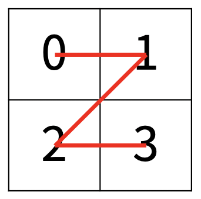
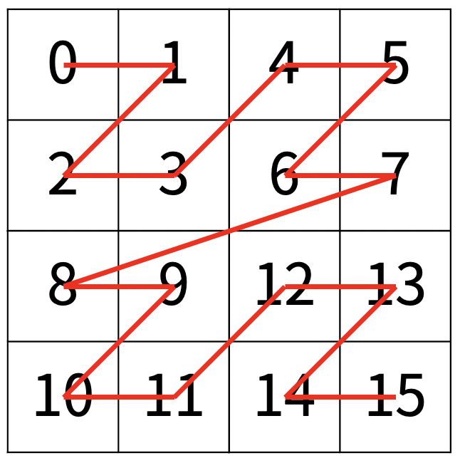
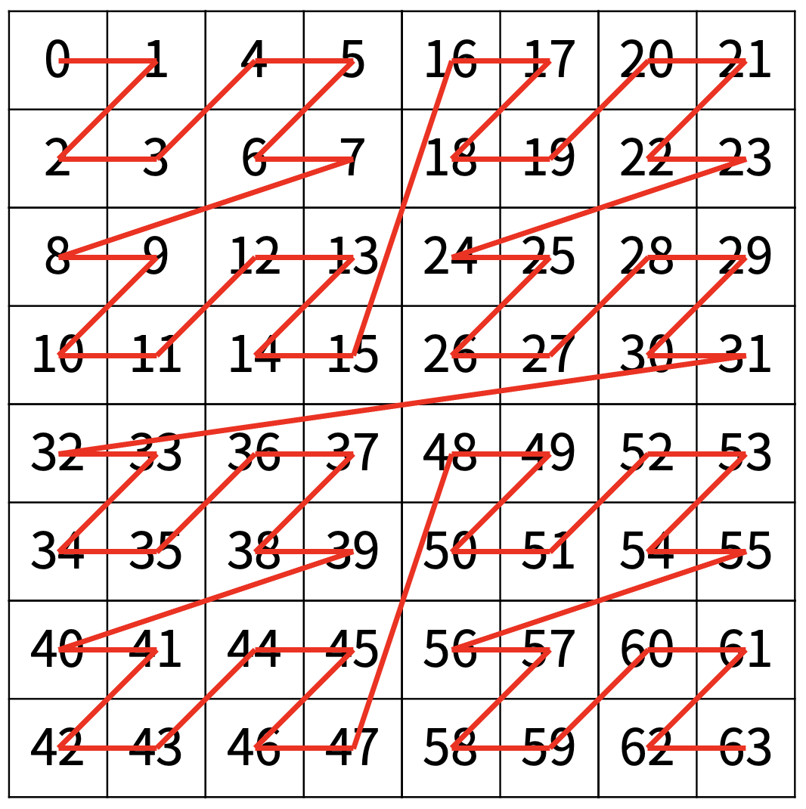
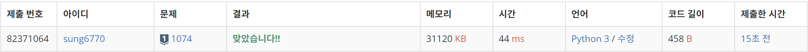
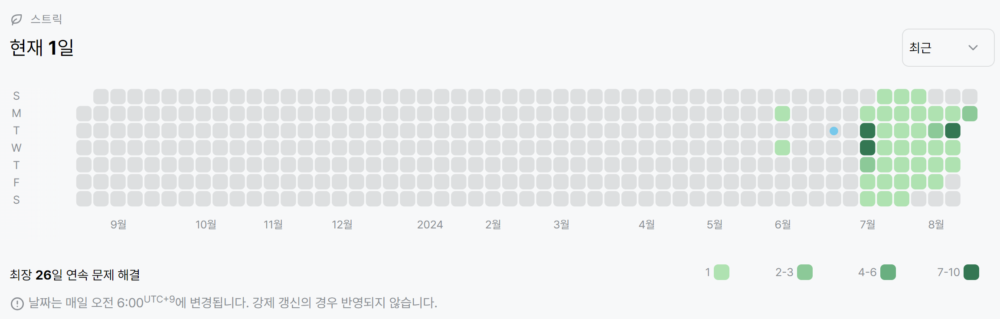

# 1074번: Z(실버 1)
| 시간 제한 | 메모리 제한 |
|:-----:|:------:|
| 0.5초  | 512MB  |

## 문제
한수는 크기가 2N × 2N인 2차원 배열을 Z모양으로 탐색하려고 한다. 예를 들어, 2×2배열을 왼쪽 위칸, 오른쪽 위칸, 왼쪽 아래칸, 오른쪽 아래칸 순서대로 방문하면 Z모양이다.

<center></center>

N > 1인 경우, 배열을 크기가 2N-1 × 2N-1로 4등분 한 후에 재귀적으로 순서대로 방문한다.

다음 예는 22 × 22 크기의 배열을 방문한 순서이다.

<center></center>

N이 주어졌을 때, r행 c열을 몇 번째로 방문하는지 출력하는 프로그램을 작성하시오.

다음은 N=3일 때의 예이다.

<center></center>

## 입력
첫째 줄에 정수 N, r, c가 주어진다.

## 출력
r행 c열을 몇 번째로 방문했는지 출력한다.

## 예제 입력 1
```text
2 3 1
```
## 예제 출력 1
```text
11
```
## 예제 입력 2
```text
3 7 7
```
## 예제 출력 2
```text
63
```
## 예제 입력 3
```text
1 0 0
```
## 예제 출력 3
```text
0
```
## 예제 입력 4
```text
4 7 7
```
## 예제 출력 4
```text
63
```
## 예제 입력 5
```text
10 511 511
```
## 예제 출력 5
```text
262143
```
## 예제 입력 6
```text
10 512 512
```
## 예제 출력 6
```text
786432
```

## 코드
```python
import sys
read = sys.stdin.readline

N, r, c = map(int, read().split())

n = 2 ** (N-1)
result = 0
while 1 <= N:
    if r / n < 1 and c / n < 1:
        result += 0
    elif r / n < 1 and c / n >= 1:
        result += (2 ** (N-1)) ** 2
        c -= n
    elif r / n >= 1 and c / n < 1:
        result += (2 ** (N-1)) ** 2 * 2
        r -= n
    else:
        result += (2 ** (N-1)) ** 2 * 3
        r -= n
        c -= n
    N -= 1
    n /= 2

print(result)
```

## 채점 결과


## 스트릭
