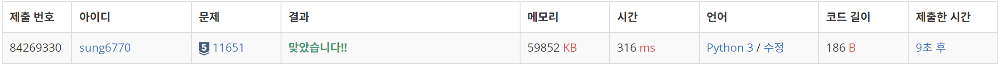
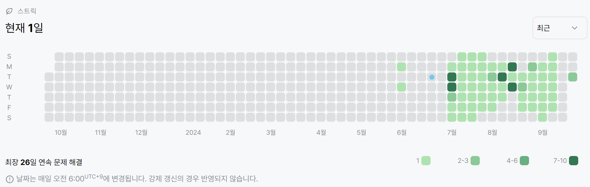

# 11651번: 좌표 정렬하기 2(실버 5)
| 시간 제한 | 메모리 제한 |
|:-----:|:------:|
|  1초   | 256MB  |

## 문제
2차원 평면 위의 점 N개가 주어진다. 좌표를 y좌표가 증가하는 순으로, y좌표가 같으면 x좌표가 증가하는 순서로 정렬한 다음 출력하는 프로그램을 작성하시오.

## 입력
첫째 줄에 점의 개수 N (1 ≤ N ≤ 100,000)이 주어진다. 둘째 줄부터 N개의 줄에는 i번점의 위치 xi와 yi가 주어진다. (-100,000 ≤ xi, yi ≤ 100,000) 좌표는 항상 정수이고, 위치가 같은 두 점은 없다.

## 출력
첫째 줄부터 N개의 줄에 점을 정렬한 결과를 출력한다.

## 예제 입력 1
```text
5
0 4
1 2
1 -1
2 2
3 3
```
## 예제 출력 1
```text
1 -1
1 2
2 2
3 3
0 4
```

## 코드
```python
import sys
read = sys.stdin.readline

N = int(read())
coord = [list(map(int, read().split())) for _ in range(N)]
for c in sorted(coord, key=lambda x: (x[1], x[0])):
    print(c[0], c[1])
```

## 채점 결과


## 스트릭
