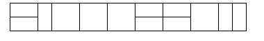
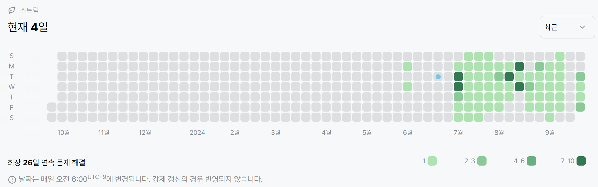

# 11727번: 2xn 타일링 2(실버 3)
| 시간 제한 | 메모리 제한 |
|:-----:|:------:|
|  1초   | 256MB  |

## 문제
2×n 직사각형을 1×2, 2×1과 2×2 타일로 채우는 방법의 수를 구하는 프로그램을 작성하시오.

아래 그림은 2×17 직사각형을 채운 한가지 예이다.




## 입력
첫째 줄에 n이 주어진다. (1 ≤ n ≤ 1,000)

## 출력
첫째 줄에 2×n 크기의 직사각형을 채우는 방법의 수를 10,007로 나눈 나머지를 출력한다.

## 예제 입력 1
```text
2
```
## 예제 출력 1
```text
3
```

## 예제 입력 2
```text
8
```
## 예제 출력 2
```text
171
```
## 예제 입력 3
```text
12
```
## 예제 출력 3
```text
2731
```

## 코드
```python
import sys
read = sys.stdin.readline

n = int(read())
memo = [1, 3]
for i in range(2, n):
    memo.append((2 * memo[i-2] + memo[i-1]) % 10007)
print(memo[n-1])
```

## 채점 결과


## 스트릭
