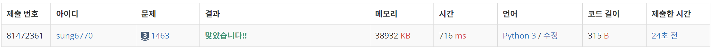
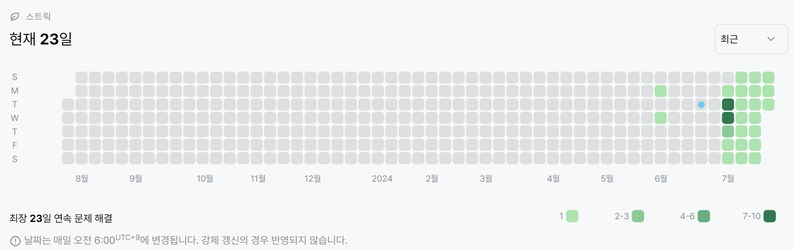

# 1463번: 1로 만들기(실버 3)
| 시간 제한 | 메모리 제한 |
|:-----:|:------:|
| 1.5초  | 128MB  |

## 문제
정수 X에 사용할 수 있는 연산은 다음과 같이 세 가지 이다.

1. X가 3으로 나누어 떨어지면, 3으로 나눈다.
2. X가 2로 나누어 떨어지면, 2로 나눈다.
3. 1을 뺀다.

정수 N이 주어졌을 때, 위와 같은 연산 세 개를 적절히 사용해서 1을 만들려고 한다. 연산을 사용하는 횟수의 최솟값을 출력하시오.

## 입력
첫째 줄에 1보다 크거나 같고, 106보다 작거나 같은 정수 N이 주어진다.

## 출력
첫째 줄에 연산을 하는 횟수의 최솟값을 출력한다.

## 예제 입력 1
```text
2
```
## 예제 출력 1
```text
1
```
## 예제 입력 2
```text
10
```
## 예제 출력 2
```text
3
```

## 코드
```python
import sys
read = sys.stdin.readline

N = int(read())
memo = [0] * (N + 1)
pos = 2
while pos < N + 1:
    memo[pos] = memo[pos - 1] + 1
    if pos % 2 == 0:
        memo[pos] = min(memo[pos], memo[pos // 2] + 1)
    if pos % 3 == 0:
        memo[pos] = min(memo[pos], memo[pos // 3] + 1)
    pos += 1
print(memo[N])
```

## 채점 결과


## 스트릭
