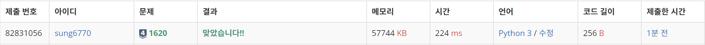
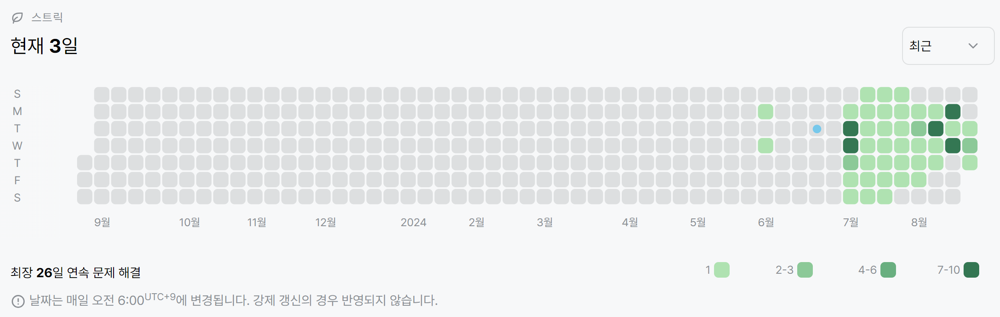

# 1620번: 나는야 포켓몬 마스터 이다솜(실버 4)
| 시간 제한 | 메모리 제한 |
|:-----:|:------:|
|  2초   | 256MB  |

## 문제
안녕? 내 이름은 이다솜. 나의 꿈은 포켓몬 마스터야. 일단 포켓몬 마스터가 되기 위해선 포켓몬을 한 마리 잡아야겠지? 근처 숲으로 가야겠어.
(뚜벅 뚜벅)
얏! 꼬렛이다. 꼬렛? 귀여운데, 나의 첫 포켓몬으로 딱 어울린데? 내가 잡고 말겠어. 가라! 몬스터볼~
(펑!) 헐랭... 왜 안 잡히지?ㅜㅜ 몬스터 볼만 던지면 되는 게 아닌가...ㅜㅠ
(터벅터벅)
어? 누구지?

...(생략)...

오박사 : 그럼 다솜아 이제 진정한 포켓몬 마스터가 되기 위해 도감을 완성시키도록 하여라. 일단 네가 현재 가지고 있는 포켓몬 도감에서 포켓몬의 이름을 보면 포켓몬의 번호를 말하거나, 포켓몬의 번호를 보면 포켓몬의 이름을 말하는 연습을 하도록 하여라. 나의 시험을 통과하면, 내가 새로 만든 도감을 주도록 하겠네.

## 입력
첫째 줄에는 도감에 수록되어 있는 포켓몬의 개수 N이랑 내가 맞춰야 하는 문제의 개수 M이 주어져. N과 M은 1보다 크거나 같고, 100,000보다 작거나 같은 자연수인데, 자연수가 뭔지는 알지? 모르면 물어봐도 괜찮아. 나는 언제든지 질문에 답해줄 준비가 되어있어.

둘째 줄부터 N개의 줄에 포켓몬의 번호가 1번인 포켓몬부터 N번에 해당하는 포켓몬까지 한 줄에 하나씩 입력으로 들어와. 포켓몬의 이름은 모두 영어로만 이루어져있고, 또, 음... 첫 글자만 대문자이고, 나머지 문자는 소문자로만 이루어져 있어. 아참! 일부 포켓몬은 마지막 문자만 대문자일 수도 있어. 포켓몬 이름의 최대 길이는 20, 최소 길이는 2야. 그 다음 줄부터 총 M개의 줄에 내가 맞춰야하는 문제가 입력으로 들어와. 문제가 알파벳으로만 들어오면 포켓몬 번호를 말해야 하고, 숫자로만 들어오면, 포켓몬 번호에 해당하는 문자를 출력해야해. 입력으로 들어오는 숫자는 반드시 1보다 크거나 같고, N보다 작거나 같고, 입력으로 들어오는 문자는 반드시 도감에 있는 포켓몬의 이름만 주어져. 그럼 화이팅!!!

## 출력
첫째 줄부터 차례대로 M개의 줄에 각각의 문제에 대한 답을 말해줬으면 좋겠어!!!. 입력으로 숫자가 들어왔다면 그 숫자에 해당하는 포켓몬의 이름을, 문자가 들어왔으면 그 포켓몬의 이름에 해당하는 번호를 출력하면 돼. 그럼 땡큐~

## 예제 입력 1
```text
26 5
Bulbasaur
Ivysaur
Venusaur
Charmander
Charmeleon
Charizard
Squirtle
Wartortle
Blastoise
Caterpie
Metapod
Butterfree
Weedle
Kakuna
Beedrill
Pidgey
Pidgeotto
Pidgeot
Rattata
Raticate
Spearow
Fearow
Ekans
Arbok
Pikachu
Raichu
25
Raichu
3
Pidgey
Kakuna
```
## 예제 출력 1
```text
Pikachu
26
Venusaur
16
14
```

## 코드
```python
import sys
read = sys.stdin.readline

N, M = map(int, read().split())
pokedex = dict()
for i in range(N):
    name = str(read().rstrip())
    pokedex[str(i+1)] = name
    pokedex[name] = i+1

for _ in range(M):
    q = read().rstrip()
    print(pokedex[q])
```

## 채점 결과


## 스트릭
