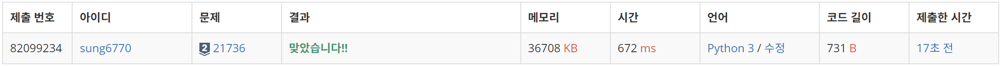
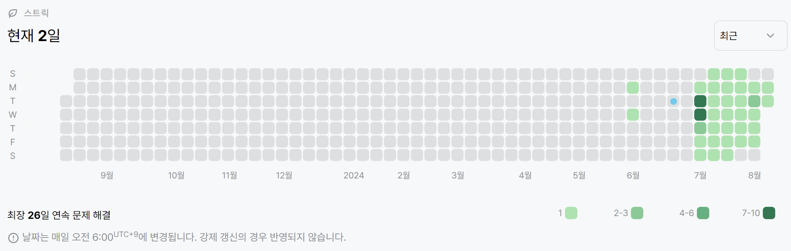

# 21736번: 헌내기는 친구가 필요해(실버 2)
| 시간 제한 | 메모리 제한 |
|:-----:|:------:|
|  2초   | 1024MB |

## 문제
2020년에 입학한 헌내기 도연이가 있다. 도연이는 비대면 수업 때문에 학교에 가지 못해 학교에 아는 친구가 없었다. 드디어 대면 수업을 하게 된 도연이는 어서 캠퍼스 내의 사람들과 친해지고 싶다. 

도연이가 다니는 대학의 캠퍼스는 
$N \times M$ 크기이며 캠퍼스에서 이동하는 방법은 벽이 아닌 상하좌우로 이동하는 것이다. 예를 들어, 도연이가 (
$x$, 
$y$)에 있다면 이동할 수 있는 곳은 (
$x+1$, 
$y$), (
$x$, 
$y+1$), (
$x-1$, 
$y$), (
$x$, 
$y-1$)이다. 단, 캠퍼스의 밖으로 이동할 수는 없다.

불쌍한 도연이를 위하여 캠퍼스에서 도연이가 만날 수 있는 사람의 수를 출력하는 프로그램을 작성해보자.
## 입력
첫째 줄에는 캠퍼스의 크기를 나타내는 두 정수 
$N$ (
$1 \leq N \leq 600$), 
$M$ (
$1 \leq M \leq 600$)이 주어진다.

둘째 줄부터 
$N$개의 줄에는 캠퍼스의 정보들이 주어진다. O는 빈 공간, X는 벽, I는 도연이, P는 사람이다. I가 한 번만 주어짐이 보장된다.

## 출력
첫째 줄에 도연이가 만날 수 있는 사람의 수를 출력한다. 단, 아무도 만나지 못한 경우 TT를 출력한다.

## 예제 입력 1
```text
3 5
OOOPO
OIOOX
OOOXP
```
## 예제 출력 1
```text
1
```
## 예제 입력 2
```text
3 3
IOX
OXP
XPP
```
## 예제 출력 2
```text
TT
```

## 코드
```python
import sys
read = sys.stdin.readline
from collections import deque

N, M = map(int, read().split())
campus = []
for _ in range(N):
    campus.append(list(str(read().rstrip())))

queue = deque()
for y in range(N):
    for x in range(M):
        if campus[y][x] == 'I':
            queue.append((x, y))

dx = [0, 0, 1, -1]
dy = [1, -1, 0, 0]
friend = 0

while queue:
    x, y = queue.popleft()
    for i in range(4):
        nx, ny = x + dx[i], y + dy[i]
        if 0 <= nx < M and 0 <= ny < N:
            if campus[ny][nx] == 'X':
                continue
            elif campus[ny][nx] == 'P':
                friend += 1
            campus[ny][nx] = 'X'
            queue.append((nx, ny))

print(friend if friend != 0 else 'TT')
```

## 채점 결과


## 스트릭
