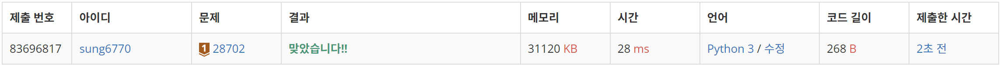
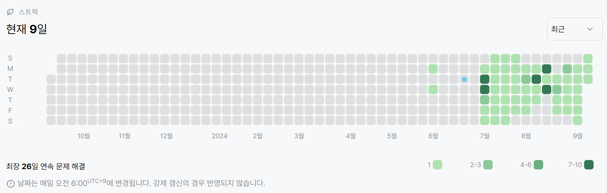

# 28702번: FizzBuzz(브론즈 1)
| 시간 제한 | 메모리 제한 |
|:-----:|:------:|
| 0.5초  | 1024MB |

## 문제
FizzBuzz 문제는 
$i = 1, 2, \cdots$ 에 대해 다음 규칙에 따라 문자열을 한 줄에 하나씩 출력하는 문제입니다.

- i가 3의 배수이면서 5의 배수이면 “FizzBuzz”를 출력합니다.
- i가 3의 배수이지만 5의 배수가 아니면 “Fizz”를 출력합니다.
- i가 3의 배수가 아니지만 5의 배수이면 “Buzz”를 출력합니다.
- i가 3의 배수도 아니고 5의 배수도 아닌 경우 i를 그대로 출력합니다.

FizzBuzz 문제에서 연속으로 출력된 세 개의 문자열이 주어집니다. 이때, 이 세 문자열 다음에 올 문자열은 무엇일까요?

## 입력
FizzBuzz 문제에서 연속으로 출력된 세 개의 문자열이 한 줄에 하나씩 주어집니다. 각 문자열의 길이는 
$8$ 이하입니다. 입력이 항상 FizzBuzz 문제에서 연속으로 출력된 세 개의 문자열에 대응됨이 보장됩니다.

## 출력
연속으로 출력된 세 개의 문자열 다음에 올 문자열을 출력하세요. 여러 문자열이 올 수 있는 경우, 아무거나 하나 출력하세요.

## 예제 입력 1
```text
Fizz
Buzz
11
```
## 예제 출력 1
```text
Fizz
```
## 예제 입력 2
```text
980803
980804
FizzBuzz
```
## 예제 출력 2
```text
980806
```

## 코드
```python
import sys
read = sys.stdin.readline
from collections import deque

N, M = map(int, read().split())
campus = []
for _ in range(N):
    campus.append(list(str(read().rstrip())))

queue = deque()
for y in range(N):
    for x in range(M):
        if campus[y][x] == 'I':
            queue.append((x, y))

dx = [0, 0, 1, -1]
dy = [1, -1, 0, 0]
friend = 0

while queue:
    x, y = queue.popleft()
    for i in range(4):
        nx, ny = x + dx[i], y + dy[i]
        if 0 <= nx < M and 0 <= ny < N:
            if campus[ny][nx] == 'X':
                continue
            elif campus[ny][nx] == 'P':
                friend += 1
            campus[ny][nx] = 'X'
            queue.append((nx, ny))

print(friend if friend != 0 else 'TT')
```

## 채점 결과


## 스트릭
