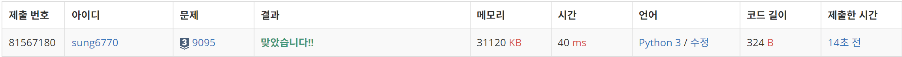
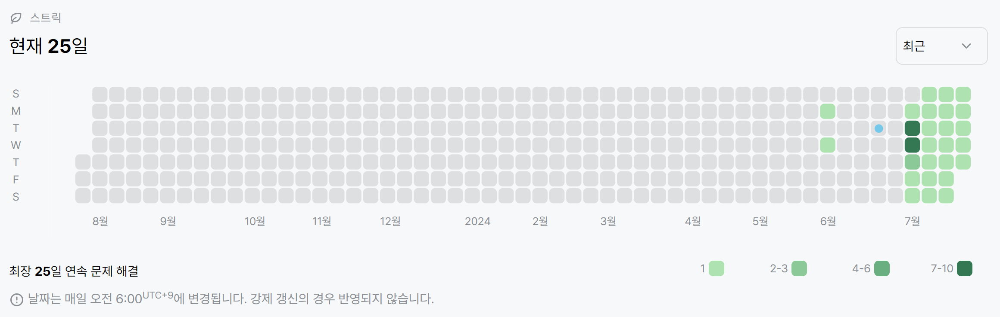

# 9095번: 1, 2, 3더하기(실버 3)
| 시간 제한 | 메모리 제한 |
|:-----:|:------:|
|  1초   | 512MB  |

## 문제
정수 4를 1, 2, 3의 합으로 나타내는 방법은 총 7가지가 있다. 합을 나타낼 때는 수를 1개 이상 사용해야 한다.
- 1+1+1+1
- 1+1+2
- 1+2+1
- 2+1+1
- 2+2
- 1+3
- 3+1

정수 n이 주어졌을 때, n을 1, 2, 3의 합으로 나타내는 방법의 수를 구하는 프로그램을 작성하시오.

## 입력
첫째 줄에 테스트 케이스의 개수 T가 주어진다. 각 테스트 케이스는 한 줄로 이루어져 있고, 정수 n이 주어진다. n은 양수이며 11보다 작다.

## 출력
각 테스트 케이스마다, n을 1, 2, 3의 합으로 나타내는 방법의 수를 출력한다.

## 예제 입력 1
```text
3
4
7
10
```
## 예제 출력 1
```text
7
44
274
```

## 코드
```python
import sys
read = sys.stdin.readline

T = int(read())
sumList = [1, 2, 4]
for _ in range(T):
    n = int(read())
    done = len(sumList)
    if n <= done:
        print(sumList[n-1])
    else:
        for i in range(done, n):
            sumList.append(sumList[i-3] + sumList[i-2] + sumList[i-1])
        print(sumList[n-1])
```

## 채점 결과


## 스트릭
