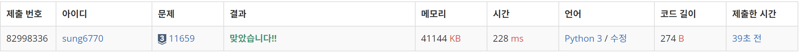
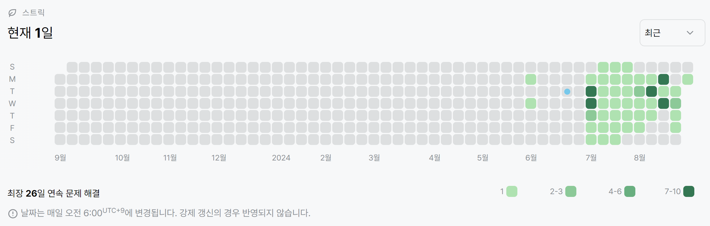

# 11659번: 구간 합 맞추기4(실버 3)
| 시간 제한 | 메모리 제한 |
|:-----:|:------:|
|  1초   | 256MB  |

## 문제
수 N개가 주어졌을 때, i번째 수부터 j번째 수까지 합을 구하는 프로그램을 작성하시오.

## 입력
첫째 줄에 수의 개수 N과 합을 구해야 하는 횟수 M이 주어진다. 둘째 줄에는 N개의 수가 주어진다. 수는 1,000보다 작거나 같은 자연수이다. 셋째 줄부터 M개의 줄에는 합을 구해야 하는 구간 i와 j가 주어진다.

## 출력
총 M개의 줄에 입력으로 주어진 i번째 수부터 j번째 수까지 합을 출력한다.

## 제한
- 1 ≤ N ≤ 100,000
- 1 ≤ M ≤ 100,000
- 1 ≤ i ≤ j ≤ N

## 예제 입력 1
```text
5 3
5 4 3 2 1
1 3
2 4
5 5
```
## 예제 출력 1
```text
12
9
1
```

## 코드
```python
import sys
read = sys.stdin.readline

N, M = map(int, read().split())
nums = list(map(int, input().split()))
for i in range(1, N):
    nums[i] += nums[i-1]
nums.insert(0, 0)

for _ in range(M):
    start, end = map(int, read().split())
    print(nums[end] - nums[start - 1])
```

## 채점 결과


## 스트릭
