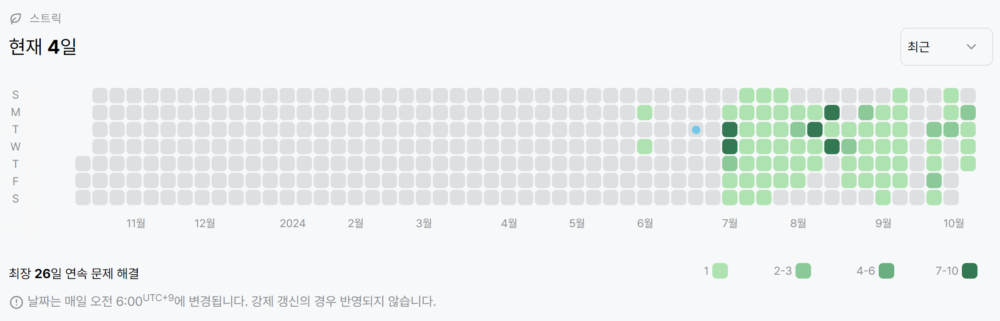

# 11724번: 연결 요소의 개수(실버 2)
| 시간 제한 | 메모리 제한 |
|:-----:|:------:|
|  3초   | 512MB  |

## 문제
방향 없는 그래프가 주어졌을 때, 연결 요소 (Connected Component)의 개수를 구하는 프로그램을 작성하시오.

## 입력
첫째 줄에 정점의 개수 N과 간선의 개수 M이 주어진다. (1 ≤ N ≤ 1,000, 0 ≤ M ≤ N×(N-1)/2) 둘째 줄부터 M개의 줄에 간선의 양 끝점 u와 v가 주어진다. (1 ≤ u, v ≤ N, u ≠ v) 같은 간선은 한 번만 주어진다.

## 출력
첫째 줄에 연결 요소의 개수를 출력한다.

## 예제 입력 1
```text
6 5
1 2
2 5
5 1
3 4
4 6
```
## 예제 출력 1
```text
2
```
## 예제 입력 2
```text
6 8
1 2
2 5
5 1
3 4
4 6
5 4
2 4
2 3
```
## 예제 출력 2
```text
1
```

## 코드
```python
import sys
read = sys.stdin.readline

N, M = map(int, read().split())
edge = [[] for _ in range(N + 1)]
for _ in range(M):
    u, v = map(int, read().split())
    edge[u].append(v)
    edge[v].append(u)


def bfs(edge, visited, u):
    queue = [u]
    visited[u] = True
    while queue:
        start = queue.pop(0)
        for v in edge[start]:
            if not visited[v]:
                queue.append(v)
                visited[v] = True


visited = [False for _ in range(N + 1)]
count = 0
for u in range(1, N + 1):
    if not visited[u]:
        bfs(edge, visited, u)
        count += 1
print(count)

```

## 채점 결과


## 스트릭
