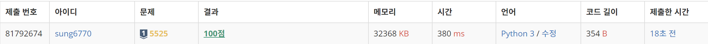

# 5525번: IOIOI(실버 1)
| 시간 제한 | 메모리 제한 |
|:-----:|:------:|
|  1초   | 256MB  |

## 문제
N+1개의 I와 N개의 O로 이루어져 있으면, I와 O이 교대로 나오는 문자열을 PN이라고 한다.

- P1 IOI
- P2 IOIOI
- P3 IOIOIOI
- PN IOIOI...OI (O가 N개)

I와 O로만 이루어진 문자열 S와 정수 N이 주어졌을 때, S안에 PN이 몇 군데 포함되어 있는지 구하는 프로그램을 작성하시오.

## 입력
첫째 줄에 N이 주어진다. 둘째 줄에는 S의 길이 M이 주어지며, 셋째 줄에 S가 주어진다.

## 출력
S에 PN이 몇 군데 포함되어 있는지 출력한다.

## 제한
- 1 ≤ N ≤ 1,000,000
- 2N+1 ≤ M ≤ 1,000,000
- S는 I와 O로만 이루어져 있다.

## 서브태스크
| 번호 | 배점 | 제한 |
|:--:|:--:|----|
| 1  | 50 | N ≤ 100, M ≤ 10 000.   |
| 2  | 50 |  추가적인 제약 조건이 없다.  |


## 예제 입력 1
```text
1
13
OOIOIOIOIIOII
```
## 예제 출력 1
```text
4
```

## 예제 입력 2
```text
2
13
OOIOIOIOIIOII
```
## 예제 출력 2
```text
2
```

## 코드
```python
import sys
read = sys.stdin.readline

N = int(read())
M = int(read())
S = str(read())
P = 'IOI'

cursor = count = answer = 0
while cursor < M - 1:
    if S[cursor : cursor + 3] == P:
        cursor += 2
        count += 1
        if count == N:
            answer += 1
            count -= 1
    else:
        cursor += 1
        count = 0

print(answer)
```

## 채점 결과


## 스트릭
