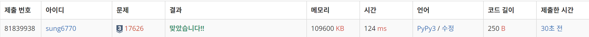

# 17626번: Four Squares(실버 3)
| 시간 제한 | 메모리 제한 |
|:-----:|:------:|
| 0.5초  | 512MB  |

## 문제
라그랑주는 1770년에 모든 자연수는 넷 혹은 그 이하의 제곱수의 합으로 표현할 수 있다고 증명하였다. 어떤 자연수는 복수의 방법으로 표현된다. 예를 들면, 26은 5<sup>2</sup>과 1<sup>2</sup>의 합이다; 또한 4<sup>2</sup> + 3<sup>2</sup> + 1<sup>2</sup>으로 표현할 수도 있다. 역사적으로 암산의 명수들에게 공통적으로 주어지는 문제가 바로 자연수를 넷 혹은 그 이하의 제곱수 합으로 나타내라는 것이었다. 1900년대 초반에 한 암산가가 15663 = 125<sup>2</sup> + 6<sup>2</sup> + 1<sup>2</sup> + 1<sup>2</sup>라는 해를 구하는데 8초가 걸렸다는 보고가 있다. 좀 더 어려운 문제에 대해서는 56초가 걸렸다: 11339 = 105<sup>2</sup> + 15<sup>2</sup> + 8<sup>2</sup> + 5<sup>2</sup>.

자연수 n이 주어질 때, n을 최소 개수의 제곱수 합으로 표현하는 컴퓨터 프로그램을 작성하시오.

## 입력
입력은 표준입력을 사용한다. 입력은 자연수 n을 포함하는 한 줄로 구성된다. 여기서, 1 ≤ n ≤ 50,000이다.

## 출력
출력은 표준출력을 사용한다. 합이 n과 같게 되는 제곱수들의 최소 개수를 한 줄에 출력한다.

## 예제 입력 1
```text
25
```
## 예제 출력 1
```text
1
```
## 예제 입력 2
```text
26
```
## 예제 출력 2
```text
2
```
## 예제 입력 3
```text
11339
```
## 예제 출력 3
```text
3
```
## 예제 입력 4
```text
34567
```
## 예제 출력 4
```text
4
```

## 코드
```python
import sys
read = sys.stdin.readline
n = int(read())

memo = [0 for _ in range(50001)]
for i in range(1, n+1):
    memo[i] = memo[i-1] + 1
    j = 1
    while j**2 <= i:
        memo[i] = min(memo[i], memo[i - j**2] + 1)
        j += 1
print(memo[n])
```

## 채점 결과


## 스트릭
