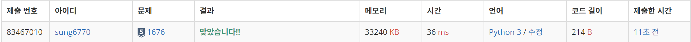

# 1676번: 팩토리얼 0의 개수(실버 5)
| 시간 제한 | 메모리 제한 |
|:-----:|:------:|
|  2초   | 128MB  |

## 문제
N!에서 뒤에서부터 처음 0이 아닌 숫자가 나올 때까지 0의 개수를 구하는 프로그램을 작성하시오.

## 입력
첫째 줄에 N이 주어진다. (0 ≤ N ≤ 500)

## 출력
첫째 줄에 구한 0의 개수를 출력한다.

## 예제 입력 1
```text
10
```
## 예제 출력 1
```text
2
```
## 예제 입력 2
```text
3
```
## 예제 출력 2
```text
0
```

## 코드
```python
import sys
import math
read = sys.stdin.readline

n = int(read())
m = list(map(int, str(math.factorial(n))))
result = 0
for i in reversed(m):
    if i == 0:
        result += 1
    else:
        break
print(result)
```

## 채점 결과


## 스트릭
