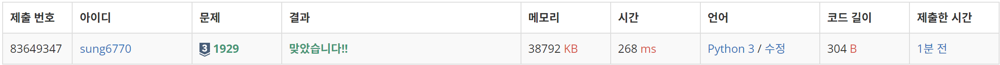
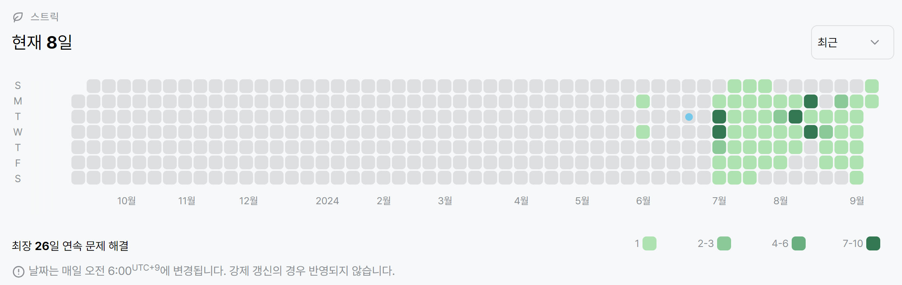

# 1929번: 소수 구하기(실버 3)
| 시간 제한 | 메모리 제한 |
|:-----:|:------:|
|  2초   | 256MB  |

## 문제
M이상 N이하의 소수를 모두 출력하는 프로그램을 작성하시오.

## 입력
첫째 줄에 자연수 M과 N이 빈 칸을 사이에 두고 주어진다. (1 ≤ M ≤ N ≤ 1,000,000) M이상 N이하의 소수가 하나 이상 있는 입력만 주어진다.

## 출력
한 줄에 하나씩, 증가하는 순서대로 소수를 출력한다.

## 예제 입력 1
```text
3 16
```
## 예제 출력 1
```text
3
5
7
11
13
```

## 코드
```python
import sys
input = sys.stdin.readline

M, N = map(int, input().split())

nums = [True] * (N + 1)
nums[0] = nums[1] = False

for i in range(2, int(N**0.5) + 1):
    if nums[i]:
        for j in range(i * i, N + 1, i):
            nums[j] = False

for i in range(M, N + 1):
    if nums[i]:
        print(i)
```

## 채점 결과


## 스트릭
