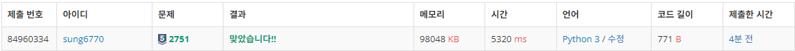
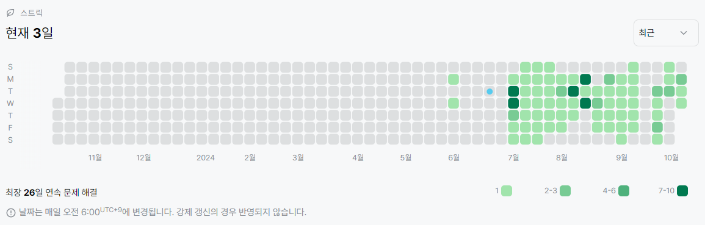

# 2751번: 수 정렬하기 2(실버 5)
| 시간 제한 | 메모리 제한 |
|:-----:|:------:|
|  2초   | 256MB  |

## 문제
N개의 수가 주어졌을 때, 이를 오름차순으로 정렬하는 프로그램을 작성하시오.

## 입력
첫째 줄에 수의 개수 N(1 ≤ N ≤ 1,000,000)이 주어진다. 둘째 줄부터 N개의 줄에는 수가 주어진다. 이 수는 절댓값이 1,000,000보다 작거나 같은 정수이다. 수는 중복되지 않는다.

## 출력
첫째 줄부터 N개의 줄에 오름차순으로 정렬한 결과를 한 줄에 하나씩 출력한다.

## 예제 입력 1
```text
5
5
4
3
2
1
```
## 예제 출력 1
```text
1
2
3
4
5
```

## 코드
```python
import sys
read = sys.stdin.readline

N = int(read())
nums = [int(read()) for _ in range(N)]


def merge_sort(arr):
    if len(arr) < 2:
        return arr

    left = merge_sort(arr[:len(arr) // 2])
    right = merge_sort(arr[len(arr) // 2:])
    return merge(left, right)


def merge(left, right):
    li = []
    l = 0
    r = 0
    while l + r < len(left) + len(right):
        if l == len(left):
            li.append(right[r])
            r += 1
        elif r == len(right):
            li.append(left[l])
            l += 1
        else:
            if left[l] < right[r]:
                li.append(left[l])
                l += 1
            else:
                li.append(right[r])
                r += 1
    return li


for i in merge_sort(nums):
    print(i)
```

## 채점 결과


## 스트릭
