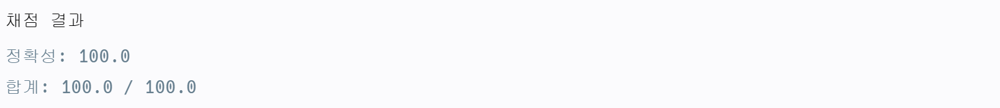

# 인사고과

## 문제
완호네 회사는 연말마다 1년 간의 인사고과에 따라 인센티브를 지급합니다. 각 사원마다 근무 태도 점수와 동료 평가 점수가 기록되어 있는데 만약 어떤 사원이 다른 임의의 사원보다 두 점수가 모두 낮은 경우가 한 번이라도 있다면 그 사원은 인센티브를 받지 못합니다. 그렇지 않은 사원들에 대해서는 두 점수의 합이 높은 순으로 석차를 내어 석차에 따라 인센티브가 차등 지급됩니다. 이때, 두 점수의 합이 동일한 사원들은 동석차이며, 동석차의 수만큼 다음 석차는 건너 뜁니다. 예를 들어 점수의 합이 가장 큰 사원이 2명이라면 1등이 2명이고 2등 없이 다음 석차는 3등부터입니다.

각 사원의 근무 태도 점수와 동료 평가 점수 목록 scores이 주어졌을 때, 완호의 석차를 return 하도록 solution 함수를 완성해주세요.
## 제한사항
- 1 ≤ scores의 길이 ≤ 100,000
- scores의 각 행은 한 사원의 근무 태도 점수와 동료 평가 점수를 나타내며 [a, b] 형태입니다.
  - scores[0]은 완호의 점수입니다.
  - 0 ≤ a, b ≤ 100,000
- 완호가 인센티브를 받지 못하는 경우 -1을 return 합니다.


## 예제 입력 1
```text
[[2,2],[1,4],[3,2],[3,2],[2,1]]
```
## 예제 출력 1
```text
4
```

## 코드
```python
def solution(scores):
    wanhoX, wanhoY = scores.pop(0)
    scores.sort(key=lambda x: (-x[0], x[1]))
    ranking = 1
    maxY = 0
    for x, y in scores:
        if wanhoX < x and wanhoY < y:
            return -1
        if y >= maxY:
            maxY = y
            if wanhoX + wanhoY < x + y:
                ranking += 1
    return ranking
```
### 코드 설명

- 주어진 점수들에서 완호의 점수 추출 
- 근무 태도 점수(첫번째 값)에 대해서는 내림차순, 동료평가 점수(두번째 값)에 대해서는 오름차순 정렬(첫번째 값은 내림차순으로 만들어 비교하지 않게 하기 위함). 
- 완호보다 모든 점수가 높은 사원이 존재하면 -1 반환, 그렇지 않으면 값 비교를 통해 순위 계산


## 채점 결과

