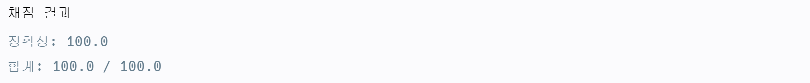

# 순위

## 문제
n명의 권투선수가 권투 대회에 참여했고 각각 1번부터 n번까지 번호를 받았습니다. 권투 경기는 1대1 방식으로 진행이 되고, 만약 A 선수가 B 선수보다 실력이 좋다면 A 선수는 B 선수를 항상 이깁니다. 심판은 주어진 경기 결과를 가지고 선수들의 순위를 매기려 합니다. 하지만 몇몇 경기 결과를 분실하여 정확하게 순위를 매길 수 없습니다.

선수의 수 n, 경기 결과를 담은 2차원 배열 results가 매개변수로 주어질 때 정확하게 순위를 매길 수 있는 선수의 수를 return 하도록 solution 함수를 작성해주세요.

## 제한사항
- 선수의 수는 1명 이상 100명 이하입니다.
- 경기 결과는 1개 이상 4,500개 이하입니다.
- results 배열 각 행 [A, B]는 A 선수가 B 선수를 이겼다는 의미입니다.
- 모든 경기 결과에는 모순이 없습니다.

## 예제 입력 1
```text
n = 5
results = [[4, 3], [4, 2], [3, 2], [1, 2], [2, 5]]
```
## 예제 출력 1
```text
2
```

## 코드
```python
def solution(n, results):
    result_table = list([0] * n for _ in range(n))
    for x, y in results:
        result_table[x-1][y-1] = 1
    for z in range(n):
        for x in range(n):
            for y in range(n):
                if result_table[x][y] == 0 and result_table[x][z] and result_table[z][y]:
                    result_table[x][y] = 1
    answer = 0
    for i in range(n):
        if sum(result_table[i]) + sum(list(zip(*result_table))[i]) == n-1:
            answer += 1

    return answer
```
### 코드 설명

- x축은 승리 승리 정보를, y축은 패배 정보를 저장하는 n*n 배열 생성
- 플로이드 워셜 알고리즘을 이용해 선수별 간접적인 승패 정보 업데이트
- 업데이트된 배열을 순회하며 모든 선수와의 우위가 정해진 선수(x축의 합과 y축의 합이 n-1) 카운트
  - zip 함수를 이용해 이차원 배열의 행과 열을 바꿀 수 있다 

## 채점 결과

